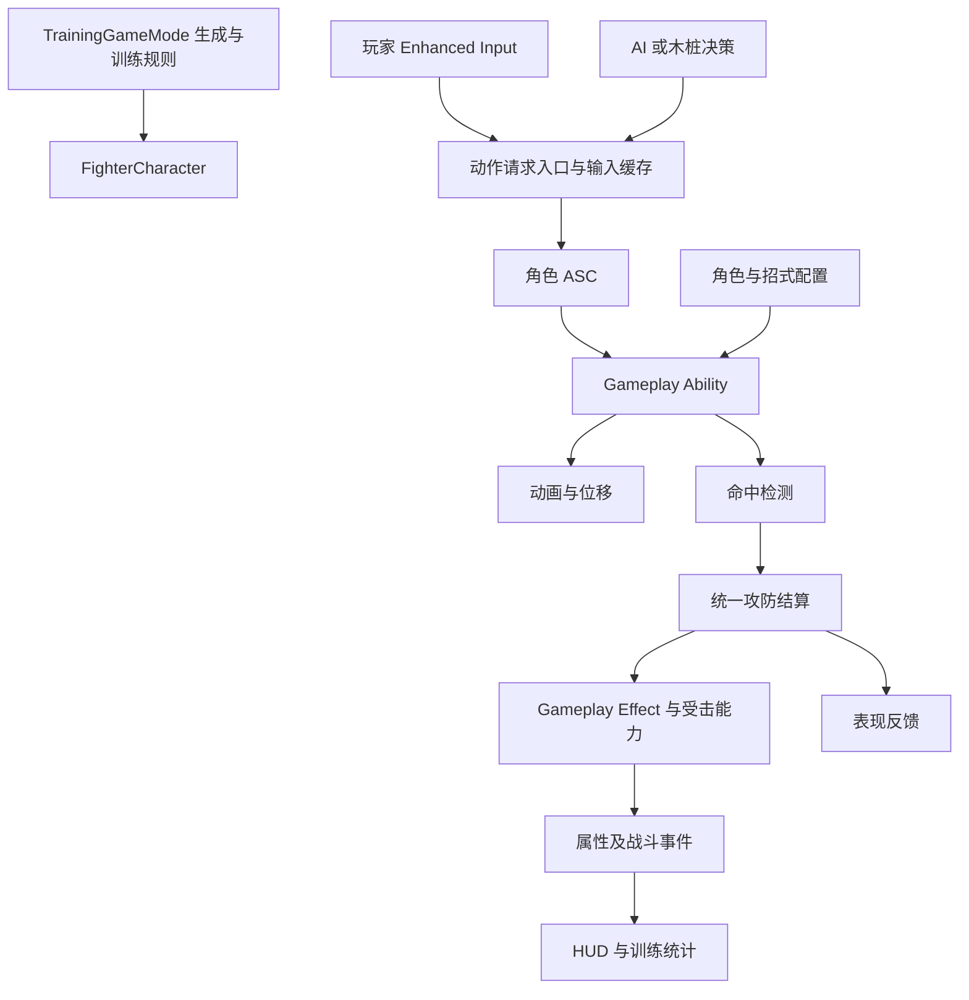

# 架构设计

版本：v0.3；日期：2026-09-15。本文描述目标架构，不是已实现状态。

## 1. 架构原则

以 UE 原生 Gameplay Framework 为骨架，以 GAS 为战斗核心。使用少量有明确职责的组件、只保存配置的数据资产和局部委托。一个游戏 C++ 模块足够启动项目。

玩家、木桩和 AI 共用 FighterCharacter、能力和攻防结算；区别仅在决策来源。

## 2. 类与组件职责

以下名称为建议自建项目类，除注明的引擎类型外，不是 UE 自动提供的完整功能。

| 建议类 | 基础技术 | 职责 |
| --- | --- | --- |
| ATrainingGameMode | AGameModeBase | 生成双方、分配目标、行为模式、胜负、训练设置与重置 |
| AArenaPlayerController | APlayerController | 玩家输入入口、菜单输入模式、HUD 与镜头协调 |
| AFighterCharacter | ACharacter | 身体、CharacterMovement、组件装配、初始化与销毁 |
| UFighterAbilitySystemComponent | UAbilitySystemComponent | 能力授予、项目输入映射、激活辅助；不塞入所有技能算法 |
| UFighterAttributeSet | UAttributeSet | 生命、行动资源、咒力、领域能量、约束及必要的变化处理 |
| UCombatInputComponent | UActorComponent | 请求提交、缓存、按下/松开、请求优先级 |
| UCombatHitComponent | UActorComponent | 活动命中窗口、轨迹检测、命中去重和结算入口 |
| UTargetingComponent | UActorComponent | 目标选择、验证、有限攻击辅助；不控制玩家镜头 |
| AArenaAIController | AAIController | 木桩模式和行为树驱动；发出共享动作请求 |
| UArenaAnimInstance | UAnimInstance | 移动动画数据、动画过渡和只读表现状态 |
| UCombatHudWidget / UTrainingPanelWidget | 原生 UMG | 已实现常驻双方属性与状态、训练设置与统计；后续可替换正式美术 |

TrainingGameMode 可在首版直接保存少量训练配置。统计增多后再按实际需要抽取对象；不为少量数据提前创建全局单例或 Subsystem。

## 3. GAS 分工

ASC 是 Ability System Component，即每个角色的能力系统组件；GAS 是包含 ASC、GA、GE、属性和标签在内的整套系统。

| GAS 类型 | 项目用途 |
| --- | --- |
| ASC | 管理角色已有能力、活动效果、标签和能力激活 |
| GA | 组织动作开始、执行、等待、取消与结束 |
| AttributeSet | Health、MaxHealth、ActionResource、MaxActionResource、CursedEnergy、MaxCursedEnergy、Energy、MaxEnergy；Energy 对外表示领域能量 |
| GE | 伤害、恢复、消耗、冷却、按时间存在的战斗效果 |
| GameplayTag | 描述动作、限制、免疫和攻击类别 |
| AbilityTask | 等待 Montage、输入、事件或执行与 GA 同生命周期的任务 |
| GameplayCue | 声音、特效等表现，不承担伤害和胜负规则 |

ASC 和 AttributeSet 首版由 Character 持有，OwnerActor 与 AvatarActor 均为该 Character。生成并具备必要控制信息后初始化 ActorInfo；授予能力和初始化属性需防重复。若后续确实要求角色销毁后保留能力，再评估 PlayerState 持有 ASC。

当前建议 GA：MeleeCombo、HeavyPunch、Kick、HeavyKick、MobileChargedBlast、StationaryChargedBlast、SwitchStance、DomainExpansion、Guard、Dodge、Throw、HitReact、Knockdown、Death。技能槽与具体 GA 不是一对一固定关系，按形态解析。Shift 统一普通闪避与取消事务，先验合法性/资源再取消旧动作并扣一次总成本；无独立玩家 ActionCancel。F 为持续防御，远程右键为独立 Aim 意图与右肩镜头状态，详见 08 v0.2。

首个实机角色为石流龙。建议 `DA_Fighter_Ishigori` 以形态解析左键与 Skill01：近战拳/腿及对应长按重击，远程移动蓄力炮/定点超级炮；Skill02 为 SwitchStance，Ultimate 为 DomainExpansion。以上为建议映射，未表示已创建。共享定义、独立 ASC 和能力实例；领域与形态是两条独立状态轴，详见 [08](08_石流龙战斗系统设计.md)。

普攻三段由一个 GA 维护段数和衔接。能力存在共享流程时才提取公共父类或 AbilityTask，避免万能技能父类。

## 4. 状态的唯一管理者

| 信息 | 唯一主要管理位置 |
| --- | --- |
| 走路/下落等移动模式 | CharacterMovement |
| 攻击、防御、受击、无敌、霸体、倒地、死亡 | ASC 上的标签，来源为明确的 GA 或 GE |
| 当前连招段、命中确认、允许衔接的动作 | 当前 GA 的实例状态 |
| 当前攻击已命中对象 | 命中组件中按攻击实例隔离的记录 |
| 动画状态 | AnimInstance 从上述状态读取，不反向维护第二套战斗真值 |
| 玩家观察方向 | Controller/镜头逻辑 |

示例标签：State.Attacking、State.Guarding、State.HitStun、State.Invulnerable、State.SuperArmor、State.KnockedDown、State.Dead。

每个临时状态明确持有者、来源和清理方式。使用 GE 时保存对应句柄；使用手动标签时管理成对添加/移除及多个来源，不允许一个动作结束误删其他效果贡献的同名状态。

禁止激活新能力与打断已执行能力分别配置。只添加 HitStun 标签不代表已有攻击自动停止。

## 5. 输入与动作请求

输入链路：Enhanced Input → 项目动作请求 → 条件检查/缓存 → ASC 激活或向活动能力传递输入。

- 普通移动与镜头输入不必全部包装成 GA。
- Input.Attack 等标签与技能槽映射由项目实现，GAS 不会自动理解。
- 玩家和 AI 使用同一请求入口；AI 可以请求立即执行，也必须经过相同的合法性检查。
- 第一版一个待执行动作槽即可，保存动作、方向和时间。防御等持续输入另存按下状态。
- 输入成功消费、超时、模式切换、死亡与重置时清理。
- 窗口打开时重新验证状态、资源和目标，避免执行已经失效的缓存。
- 缓存只表达意图，不越过取消权限。

请求返回明确结果：已执行、已缓存、状态禁止、资源不足、冷却中、目标无效。AI 与调试 UI 使用同一结果。

## 6. 动画、镜头和位移

普通移动使用 CharacterMovement 与 Blend Space。战斗使用 Montage 和 AbilityTask；动画通知报告窗口事件，由能力判断其是否属于当前动作。

通知实例中不保存角色独有的命中集合、目标引用或运行计时。必要时通过动作实例标识拒绝旧 Montage 遗留事件。

近战位移优先使用与动画匹配的 Root Motion；突进按需使用 Motion Warping，并限制距离、角度与追踪窗口。缺少合适 Root Motion 资源时先做明确的占位位移，不同时混用多个位置控制来源。

移动控制权需明确：普通移动、AI 寻路、Root Motion、击退、投技配对不能同时无序控制角色。任何能力取消后都要恢复正确的移动模式和旋转设置。

镜头采用 SpringArm + CameraComponent，控制旋转与角色朝向解耦。TargetingComponent 管目标，玩家侧镜头决定是否辅助回正；玩家手动观察优先。仅在确有复杂切换需求时扩展 PlayerCameraManager。

## 7. 命中检测与结算

### 7.1 检测

- 拳脚/武器：根据骨骼插槽轨迹 Sweep，快速旋转时增加采样。
- 投射物：Actor + ProjectileMovement。
- 石流龙领域外炮击：发射时一次即时射线结算，镜头确定目标点，再从头部炮口 Socket 检测最近阻挡。领域内自动满威力炮生成独立球体，按曲线路径追踪并扫掠接触结算；不在生成时提交射线或直接伤害。每球独立攻击 ID 与 DomainSessionId，光束/路径特效不重复伤害。
- 范围技能：球形或盒形查询。
- 命中去重键：攻击实例 + 命中段 + 目标。
- 首版去重必须覆盖整个有效窗口，不仅覆盖一次查询循环。

炮击在起手阶段有限辅助转向，在发射时固定方向；无锁定时按镜头目标点空放。炮口处于阻挡物内时拒绝从墙外发射。先用头部占位 Socket 验证，不依赖正式发型网格。若后续改为可飞行炮弹，单独调整命中和取消策略，不同时保留射线伤害与炮弹碰撞伤害。

移动炮与定点超级炮按按住时长蓄力，伤害与累计成本封顶后可持续保持，松开才进入锁向前摇并发射；基础咒力在合法激活时提交，增量按伤害增长支付，中断不退已扣部分。资源不足仅限制强度，不强制发射，持炮暂停被动回咒。超级炮未达最低门槛松开收招无伤害；冷却在发射或已付费中断时启动一次，不能提前等完。输入会话隔离形态与按下/松开，成功闪避取消、菜单、失焦、死亡和重置不触发旧松键发射，并恢复镜头与旋转设置。

DomainExpansion 管理结印、捕获、参与者、时限与必中标记；TrainingGameMode 保存单机领域上下文，两个领域并存时暂停自动炮并清在途球，独立计时；剩余领域下个原定调度点恢复，不补发。追踪球实际接触才结算，绕过普通闪避免疫，尊重倒地、死亡和重置保护；曲线追踪不保证数学上绝对命中；具体防御、到期及双领域顺序见 08。共享环境表现只在最后一个领域结束后清理，不增加通用领域对拼框架。

### 7.2 结算入口

输入包含攻击者、目标、攻击实例、命中段、攻击配置、位置与来袭方向。

处理顺序：验证 → 去重 → 无敌/目标状态 → 攻击类型、防御、投技、霸体 → 生成结果 → GE/受击能力 → 统计与表现。

结果可为普通命中、防御、投技成立、无敌忽略、无效命中。成功防御和免疫是否消费本段命中，由招式规则明确，不能下一帧意外绕过原结果重新造成伤害。

简单伤害通过 SetByCaller 传给 GE。确有多属性公式后再引入 ExecutionCalculation。伤害统计区分原始伤害、结算伤害和实际生命减少，训练无限生命也应保留可解释的统计。

同一逻辑更新内双方命中时，需在 M2/M3 明确规则：允许有效普通攻击换血；已失效的后续命中不得继续结算。必要时在命中组件附近集中收集并稳定处理本批结果，不为此提前建设通用战斗模拟引擎。

## 8. AI 与木桩

目标方案为 Behavior Tree + Blackboard。当前只有一个对手，由 GameMode 分配，不需要先上 AI Perception 或 EQS。

Blackboard 保存目标、距离、是否可行动等决策输入，避免复制维护第二套生命与冷却。攻击 Task 发共享请求，等待完成/失败；任务中止时取消自身订阅，并按动作规则处理它发起的能力。

木桩仍拥有完整角色、ASC、动画与碰撞，仅停止主动决策。模式切换停止旧移动与待执行请求，释放持续防御等旧行为。受击等被动过程继续遵守战斗规则。

AI 难度由反应延迟、决策周期、距离偏好、攻防概率和连招成功率决定，不直接读取玩家尚未表现出来的输入来瞬间反制。

## 9. 数据与通信

FighterDefinition 保存角色资源、初始属性、能力列表和技能槽。AttackDefinition 保存招式动画、各段伤害、攻击类别、检测参数、取消与衔接规则、表现引用。

只保存配置，不保存当前连招段、命中对象、计时器和目标。先用 UDataAsset；需要资产发现、分组加载时再考虑 UPrimaryDataAsset 和 AssetManager。

已知所属关系直接调用；跨类型受击对象可用少量接口；属性变化和命中结果通过局部委托通知 UI/统计。订阅必须随对象失效、换目标、重置和销毁清理。初期不做全局事件总线。

## 10. 结束、重置与对象生命周期

能力结束流程覆盖正常完成、动画中断、主动取消、受击、死亡、目标失效和 EndPlay。清理需要幂等，重复进入也不产生错误。

清理项：攻击检测、计时器、事件订阅、输入窗口、临时效果/标签、移动限制、临时表现和对象引用。

训练重置顺序：

1. 暂停新动作请求和 AI 决策。
2. 取消活动能力，结束投技等双方协调流程。
3. 按来源清理临时效果、投射物、窗口和计时器；保留定义为基础配置的永久效果。
4. 重置双方位置、旋转、移动模式和速度。
5. 恢复初始属性；清空输入、连击、命中与统计记录。
6. 重新验证目标并恢复指定对手模式。

保留授予的能力，除非角色重新生成；不能每次重置重复授予。初始化/重置资源允许走集中入口，正常战斗中的伤害、消耗、恢复应走 GE。

## 11. UE 参考

- [Gameplay Framework](https://dev.epicgames.com/documentation/unreal-engine/gameplay-framework-quick-reference-in-unreal-engine)
- [GAS 概览](https://dev.epicgames.com/documentation/en-us/unreal-engine/understanding-the-unreal-engine-gameplay-ability-system)
- [Enhanced Input](https://dev.epicgames.com/documentation/unreal-engine/enhanced-input-in-unreal-engine?lang=en-US)
- [Motion Warping](https://dev.epicgames.com/documentation/en-us/unreal-engine/motion-warping-in-unreal-engine)
- [Behavior Tree](https://dev.epicgames.com/documentation/unreal-engine/behavior-tree-in-unreal-engine---user-guide?lang=en-US)

具体 API 以本机 5.8.2 头文件和对应版本文档为准，不凭旧教程中的接口名直接实现。
