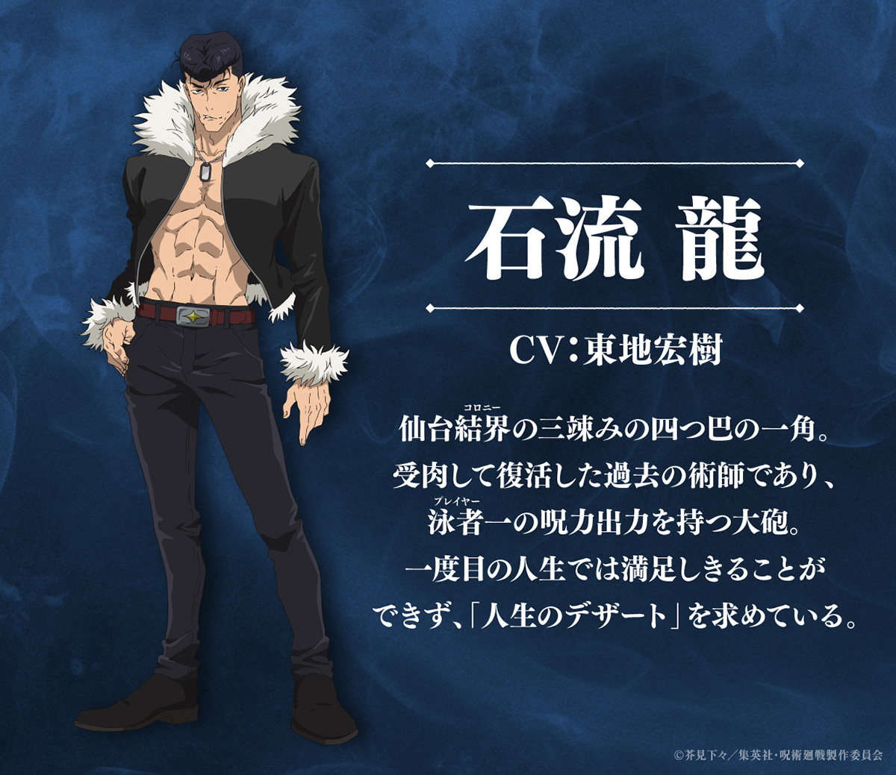

# 石流龙：首个实机角色方案

版本：v0.3；日期：2026-09-15；网络资料查阅日期同上。

**已确认：本 Demo 第一个实机角色使用石流龙。** 当前默认由玩家和对手镜像使用；技能配置、数值、动画与美术接入仍需原型验证。本文是设计与资料记录，不代表已经实现。

项目整体 IP 同时确认为《咒术回战》，后续角色与术式内容也以该 IP 为基线。石流龙是首个落地角色；当前不因此增加其他角色的开发任务。

## 1. 角色形象与资料核对

图源：[《咒术回战》动画官网，2026-03-22 角色及声优公告](https://jujutsukaisen.jp/news/20260322_02.php)。图片保持原样，版权标识见图。资料图用于角色设计参考，不等同于工程已获得可用模型。

| 项目 | 核对结果 | 依据 |
| --- | --- | --- |
| 姓名 | 石流龙；日文「石流 龍」，读音 いしごおり りゅう；英文常写 Ryu Ishigori | 官方角色图与 [动画资料解说](https://times.abema.tv/articles/-/10234570) |
| 身份 | 受肉复活的过去术师，参与死灭回游的仙台结界战斗 | 官方角色图；[动画第 59 话简介](https://jujutsukaisen.jp/episodes/59.php) |
| 核心辨识 | 高耸飞机头、敞胸深色外套、浅色毛领与袖口，体格结实 | 上方官方图直接可见 |
| 战斗特征 | 高咒力输出；从头部发出炮击，与近身肉搏结合 | 官方图对高输出的介绍；[ABEMA 角色解说](https://times.abema.tv/articles/-/10234570) |
| 术式/招式 | 术式为咒力放出；标志性炮击常记为 Granité Blast，中文资料存在不同译名 | ABEMA 解说；[中文条目用于译名对照](https://moegirl.uk/index.php?title=%E7%9F%B3%E6%B5%81%E9%BE%99&variant=zh-sg) |
| 领域展开 | 未公开完整名称与规则；动画短暂意象报道可供推断 | 能力解说及 08 的证据表；不把推断当官方结论 |

资料强度区分：形象和身份优先采用动画官方发布；能力细节使用 ABEMA 的二手解说，中文百科仅供译名比对。本次没有逐页核验漫画原本。文档统一使用“咒力炮击”作工作名，不把“花岗岩冲击”“冰沙冲击波”等译法宣称为唯一官方中文定名。

## 2. 当前战斗设计入口

完整规则移至 [08_石流龙战斗系统设计](08_石流龙战斗系统设计.md)。本页保留角色资料与美术来源；不再维护另一套技能数值。

| 内容 | 当前方向 |
| --- | --- |
| 近战基础攻击 | 推荐方案二：三段拳与长按重拳；不耗咒力 |
| 近战技能一 | 腿击与长按重踢；不耗咒力 |
| 远程基础攻击 | 左键按住可移动蓄力，松开发炮；耗咒力 |
| 远程技能一 | 定点超级蓄力炮，以用户指定的乙骨决战表现为参考 |
| 技能二 | 切换近战/远程，不免费取消或刷新冷却 |
| 绝技 | 原创补完领域，自动满威力超级炮沿曲线追踪领域参与者；无素材先用球体 |
| 资源建议 | 生命、行动资源、咒力、领域能量 |

领域视觉采用烟火/咒力绽放方向；刀光与乙骨后期领域的关联、乌鹭候选意象和证据局限见 08。领域工作名“极宴流光”及规则均为原创，不是官方公布名称。

## 3. 素材与复用

模型优先检查旧 FBX 的骨骼、比例、朝向与材质；拳腿、重击、两种蓄力与领域结印需要分别验证动画，头部建议 Socket 为 Muzzle_Head。角色图不能代替可用模型。

旧源码只复用有价值的瞄准/遮挡、目标过滤和清理思路，动作、消耗与伤害重新接 GA/GE；旧领域不自动成为新规则。历史检查见 [04](04_旧项目评估与复用方案.md)，实际素材检查与开发状态以 [开发计划](05_开发计划与验收.md) 的记录为准。

## 4. 变更说明

本次按后续讨论将“两个独立攻击技能 + 强化炮击绝技”改为“形态基础攻击 + 形态技能一 + 技能二切形态 + 领域绝技”。旧版排除领域、只用三种资源的建议已被替换。近战方案二、具体键位与数值仍需原型验证。
