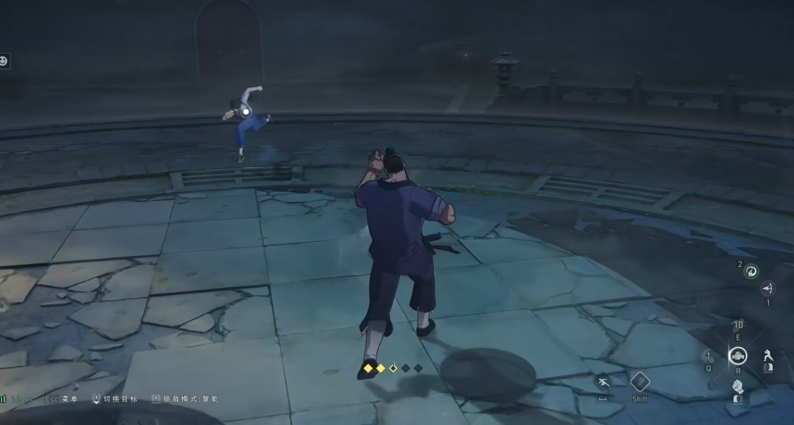
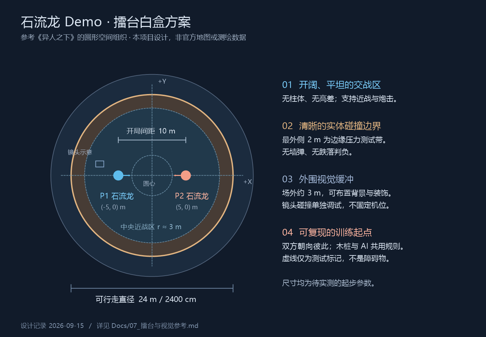

# 擂台与视觉参考

版本：v0.3；日期：2026-09-15；网络资料查阅日期同上。

本页包含《异人之下》的实机参考截图，以及为本 Demo 绘制的俯视布局。截图用于观察空间与镜头；布局和数值是本项目默认设计，不是参考游戏官方地图或测绘结果。

本项目 IP 已确认为《咒术回战》。《异人之下》在本页承担擂台空间与镜头参考；正式场景的命名和美术主题应与《咒术回战》的内容方向一致，具体地点仍待选择，不默认采用罗天大醮等其他 IP 场景设定。

## 1. 《异人之下》实机场景参考

来源：[3DM《异人之下荣山怎么玩》](https://ol.3dmgame.com/gl/309927.html)，页面日期 2025-06-30，页面注明来源 biubiu。上图为原页面截图，未裁剪或去除标记；属于第三方文章中的实机素材，不能据此确认录制版本或具体地图名称。

从图片可直接观察到：圆弧形场地边缘、石质铺地、外圈台阶与栏杆，第三人称镜头位于玩家后方略高处；中央没有明显大型遮挡物。图中对手处于空中，说明它记录的是战斗瞬间，不能用来判断出生位置。

对本项目的启发是让交战空间开阔、边界易读、角色轮廓突出。首版白盒保持完全平坦；图中的台阶、碎石和外围建筑先只作装饰参考。单张截图不能证明自由镜头的操作方式、精确尺寸或碰撞规则。

动态参考入口：[IGN 中国 PvP 实机演示，2023-12-01](https://www.bilibili.com/video/BV11c411q7dY/)；[二柄“入世测试”试玩，2024-12-09](https://www.bilibili.com/video/BV1b5qNYbEJ1/)。本次核对了发布页面信息，未逐帧观看，不记录未经核验的时间戳或镜头参数。

## 2. 本项目擂台俯视示意

图为本项目原创白盒设计，参考上方实机截图的圆形空间组织。没有复制《异人之下》的地图数据；尺寸、出生点、测试区与摄像机符号均为本项目规划。图中虚线表示测试路径，不是场内障碍物。

| 项目 | 默认起步值/规则 | 目的 |
| --- | --- | --- |
| 可行走场地 | 圆形平地，直径 24 m，半径 12 m；UE 尺寸约 2400 cm | 同时留出近战和炮击试探空间 |
| 原点与轴 | 圆心 `(0,0)`，图中 +X 向右、+Y 向上 | 便于生成与重置 |
| 玩家出生点 P1 | 地面 XY `(-500,0)` cm，面向 +X | 与对手对称起步 |
| 对手出生点 P2 | 地面 XY `(500,0)` cm，面向 -X | 初始距离 10 m |
| 出生高度 | 平地 Z 加角色 Capsule 半高及小幅安全余量 | 避免嵌地；不把地面坐标直接当角色中心 |
| 中央近战测试区 | 半径约 3 m 的参考圈，无实际限制 | 测试拳击、投技、取消与交叉移动 |
| 边缘压力测试带 | 最外侧约 2 m，仅为测试标记 | 测试受击击退、贴墙炮口与镜头收缩 |
| 外围缓冲区 | 场地之外建议再预留约 3 m 放置外围表现 | 留出视觉纵深，具体碰撞另行设置 |
| 摄像机 | 跟随玩家且可自由观察；图示仅为开局示意位置 | 不因锁敌而固定机位 |

24 m 是可调白盒起点。炮击有效距离未定；在正式定值前测试近、中、远距离命中与空放，避免把整个擂台自动变成无风险射击区。

## 3. 场景与炮击的共同约束

- 边界阻止角色越界，首版无跌落判负、墙弹或场景破坏。
- 领域外实体围墙/边界阻挡炮击；装饰物是否阻挡必须与外观一致。头部贴墙时不能利用镜头视线穿墙命中。08 新增领域必中为明确例外，仅对已登记参与者走专门结算，不能跨领域/跨擂台攻击。
- SpringArm 的遮挡响应与角色/炮击碰撞分别核验。外围缓冲区不保证相机可穿过所有墙体。
- 中央不放大型柱子或高差，先验证双人接近、交叉、追击、侧移与重置。
- 稍后增加石质材质和外围建筑时，保证攻击起手、蓄力亮点和玩家/对手标识清楚可见；暗色氛围不照搬为过暗画面。

## 4. 最小白盒验收

1. 两角色对称生成、面向彼此，重置保持一致且不重叠/嵌地。
2. 开局、近身、边缘与交叉移动时，手动转动和回正镜头正常。
3. 沿边移动、向边缘突进、受击击退均不越界或持续卡住。
4. 中距离炮击、侧移躲避、正面防御、贴墙射击可按共享规则验证。
5. 同一测试分别由玩家与 AI 请求执行；切换木桩不破坏受击与边界行为。

结果写入 [05_开发计划与验收](05_开发计划与验收.md)，记录最终采用的尺寸和镜头参数。本次只绘制文档图，未建立或修改 UE 关卡。

## 5. 图片记录

新增领域概念、战斗流程及证据推断图见 [08](08_石流龙战斗系统设计.md)，是本项目设计，不是《异人之下》或《咒术回战》实机/原片画面。

| 文件 | 来源与性质 |
| --- | --- |
| `assets/ishigori-official-20260322.jpg` | 动画官网角色图，见 [06](06_石流龙角色方案.md)；原图保留 |
| `assets/hidden-ones-arena-reference.jpg` | 本页 3DM 文章中的实机图；原图保留 |
| `assets/arena-layout.png` | 本项目原创布局示意，2026-09-15 绘制 |
| `assets/render-arena-layout.ps1` | 布局图绘制源文件；Windows PowerShell 执行后生成同目录 PNG |

外部图只作为文档参考，不直接放入游戏 Content。所有外部链接与图片均记录到页，便于之后复查来源。
