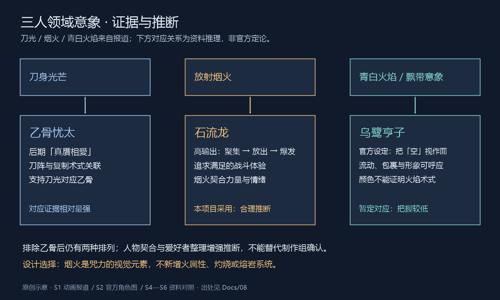
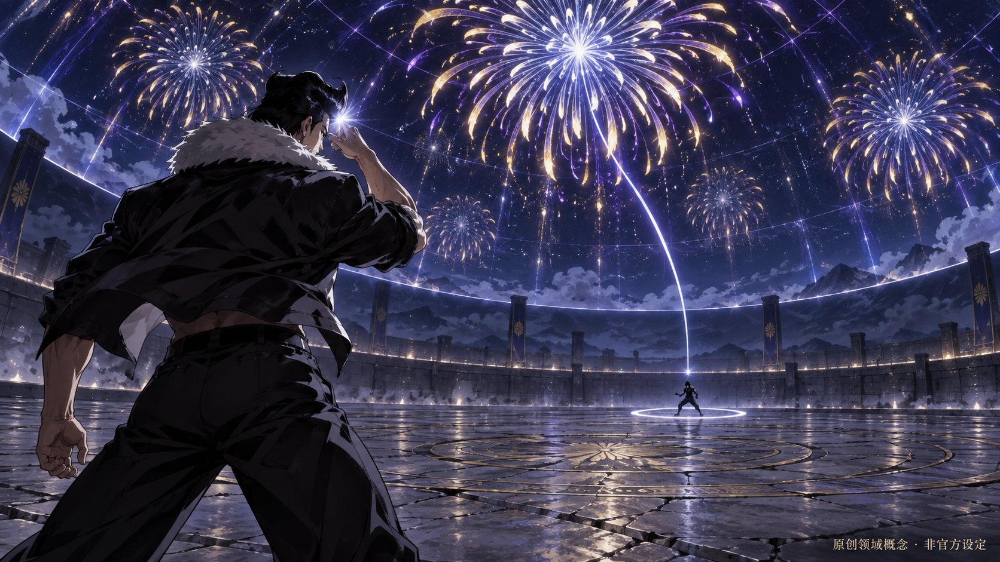
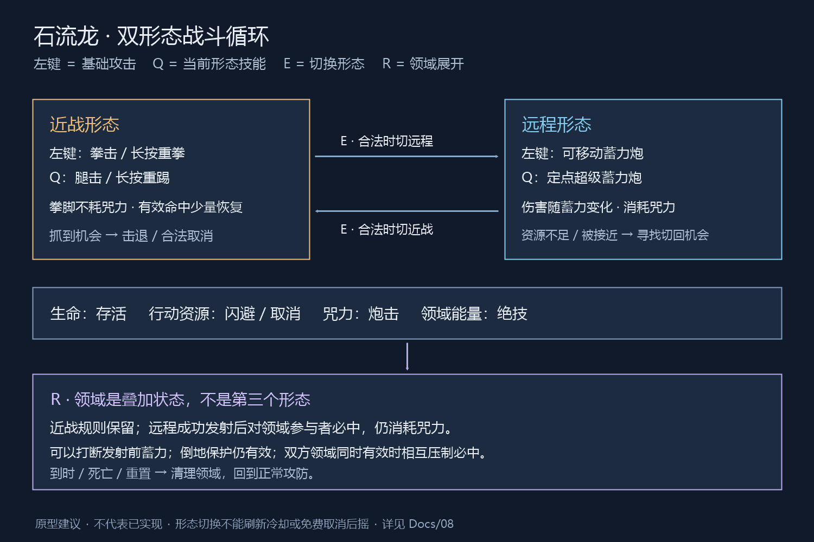
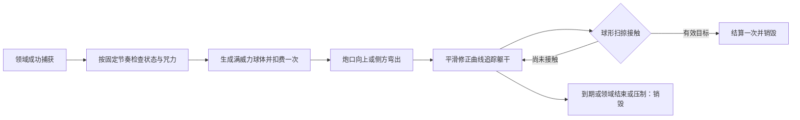

# 石流龙战斗系统设计：近远程形态与领域展开

版本：v0.4；更新日期：2026-09-18。状态：可供原型实施的设计稿，尚未实现或通过实机平衡验证。

[文档导航](README.md) · [角色资料](06_石流龙角色方案.md) · [开发计划](05_开发计划与验收.md)

**当前方向：近战拳脚不消耗咒力，远程左键为可移动蓄力炮；技能一随形态变化，技能二切换近远程；领域成功展开后自动发射满威力超级炮，沿曲线追踪纳入领域的目标。** 近战采用方案二作为推荐原型：左键拳击、技能一腿击，分别长按派生重拳/重踢。具体键位、规则和数值为本稿建议，不冒充用户已逐项定案。

本稿取代旧版“Skill01 突进重拳、Skill02 普通炮、Ultimate 强化炮”的角色配置。保留 GAS、自由镜头、单机训练与共享攻防框架。新增领域是本项目原创补完，既不复刻未知原作规则，也不直接照搬旧工程领域实现。

2026-09-16 用户确认：Shift 闪避并取消动作；远程右键按住瞄准；F 防御格挡；远程炮击伤害封顶但可一直保持蓄力，咒力成本随伤害提高。下文窗口、成本、镜头参数与恢复方式仍为原型建议。

同日领域修订：成功展开后无需玩家蓄力，自动输出定点超级炮的满蓄威力，沿曲线追踪目标；无美术素材时用球体占位。第 8 节取代旧版“玩家手动发炮后直接必中结算”。自动频率、耗咒和输入互斥为下面明确标记的原型建议，尚未写入游戏代码。

2026-09-17 行为修订（已实现并通过回归，实现细节见 M6 阶段记录 §8–§9）：
- **移动 + Shift = 加速跑**，不再前扑闪避；原地 Shift 保留后撤闪避（无敌帧与攻击取消不变）。闪避保留无敌帧与取消语义，仅表现从 Montage 改为直接起跑。
- **切形态时长 0.25s → 0.1s，且不再打断移动**（原作石流龙随意开咒力炮的口径；参考 DMC/猎天使魔女即时换装惯例）。
- **远程开火转身**：蓄力与弹体存续期间角色以 540°/s 限速平滑转向镜头 yaw（PUBG/COD 开火转身口径），非瞄准时角色仍朝移动方向；攻击弹体沿镜头方向飞行，与准星一致。
- **近战出招磁吸**：目标 ≤600cm 且在前半球 → 出招瞬间面向目标；攻击有效距离（180cm）外、≤350cm → 出招附带 50–120cm 滑步贴近（“瞬移到面前”的吸引感）；背后目标不吸附。**镜头不参与索敌回正**（用户定案：近战镜头完全由玩家控制；索敌键硬锁时角色才持续面向目标）。
- **准星**：仅远程形态显示（蓄力向心收拢、瞄准收半、领域变色）；近战无准星。
- **相机三档**：近战居中（人物在屏幕中线）、远程待机右肩、瞄准贴肩 + FOV 收窄，切换平滑插值。
- 炮击表现改为可见弹体（小球占位）：直线飞行、撞墙销毁、接触结算与射线口径一致。

上述修订已包含在 M3/M5/M6/M7 自动化回归中（M3 118、M5 68、M6 37、M7-A 25、M7-B 21 全绿）。

## 1. 设计依据与证据边界

### 1.1 本次查到了什么

| 编号 | 来源与日期 | 可支持的内容 | 不能据此断言 |
| --- | --- | --- | --- |
| S1 | [ABEMA：第 59 话三人领域意象，2026-04-01](https://times.abema.tv/articles/-/10235489)；[同篇繁中版](https://times.abema.tv/zt/articles/-/10236184) | 动画短暂呈现刀光、烟火、青白火焰三组意象 | 两篇是同一报道的语言版本，不算两份独立证据；未明确公布全部领域规则 |
| S2 | [动画官网：角色发布，2026-03-22](https://jujutsukaisen.jp/news/20260322_02.php) | 官方石流龙与乌鹭形象、人物简介及术式方向 | 角色图不是领域设定集 |
| S3 | [ABEMA：石流龙能力解说，2026-04-10](https://times.abema.tv/articles/-/10234570) | 咒力放出、头部炮击与展开未完成的情节 | 不提供游戏伤害、冷却或本站原创领域名 |
| S4 | [集英社《咒术回战》28 卷介绍](https://www.shueisha.co.jp/books/items/contents.html?jdcn=08X10000000052758200) | 后期新宿战乙骨展开领域的出版线索 | 页面简介没有详细说明领域内部图像 |
| S5 | [ciatr：乙骨“真贋相愛”解说](https://ciatr.jp/topics/324207) | 第 249 话领域名、刀与复制术式的关联 | 属二手解说，本次未逐页核验正版漫画 |
| S6 | [爱好者百科：领域展开条目](https://w.atwiki.jp/aniwotawiki/pages/52368.html) | 记录了“石流烟火、乌鹭青白火与羽衣”的对应解读 | 爱好者整理不是制作组确认；编辑内容可变化 |
| S7 | [ABEMA：第 59 话乙骨与石流对决，2026-03-27](https://times.abema.tv/articles/-/10234745?page=1) | 石流的高咒力输出“大炮”定位、双方准备全力放出的对决 | 未公布蓄力秒数、消耗公式或无限持炮能力 |

补充判断：咒力储量与一次放出的输出上限应分别建模。用有限咒力支持不同强度炮击符合角色方向；线性伤害/成本、满蓄保持、不耗咒力的近战均是本项目玩法规则，不能反推为原作精确机制。当前不增加过热、自爆或火焰持续伤害。

本次核对了网页与官方角色图，没有逐帧播放完整第 59 话，也没有得到动画分镜或制作组解说。没有使用无法确认出处的截图冒充原片证据；以下关系图是资料推理示意，不是动画截帧复原。

### 1.2 从乙骨排除，再比较石流与乌鹭

**第一步：刀光最有理由对应乙骨。** 后期“真贋相愛”（中文常写“真赝相爱”）的刀阵与复制术式有明确联系，刀身意象与其相符。它是三组对应里证据最强的一组；但后期设定只能增强对应判断，不能自动证明动画每个剪辑镜头的归属。[S4](https://www.shueisha.co.jp/books/items/contents.html?jdcn=08X10000000052758200)、[S5](https://ciatr.jp/topics/324207)

**第二步：烟火更适合石流龙。** 官方角色图把他描述为追求能够满足自己的战斗、拥有极高输出的“大炮”。集中能量、瞬间绽放、短暂却强烈的满足感，可以共同转化为烟火意象。这是人物与能力的设计解释，不是“他来自古代，所以领域必定是烟火”的证明。[S2](https://jujutsukaisen.jp/news/20260322_02.php)

**第三步：青白火焰/羽衣般的意象暂归乌鹭更合理，但把握较低。** 官方图确认乌鹭把“空”当作“面”操作；透明、飘动、折叠和包裹感与其形象有联系，爱好者资料也作此对应。然而她并未因此被证实使用火焰术式；颜色或飘带外观不能单独决定能力属性。[S2](https://jujutsukaisen.jp/news/20260322_02.php)、[S6](https://w.atwiki.jp/aniwotawiki/pages/52368.html)

排除乙骨以后仍有两种排列，人物设定和爱好者对应记录只是进一步支持“烟火→石流”的选择。**本项目采用烟火方向；不宣称石流龙官方领域已经定名或确认是火属性。**

### 1.3 “元素”应该怎么理解

- 核心能力元素：高输出咒力的聚集、放出、爆发。
- 空间视觉元素：夜空穹顶、放射状光束、烟火余迹、开阔对决场。
- 情绪元素：满足、尽兴、终场绽放；契合石流的战斗欲望。
- 不据此增加：火焰灼烧、熔岩地面、刀阵复制、天空扭曲或全属性控制。

“烟火”是咒力的视觉组织方式，不是新增一套火元素伤害系统。

## 2. 领域视觉概念

上图为 AI 生成的原创设计概念，图内已标注“非官方设定”。穹顶、石台、色彩、烟火构图均为美术建议，不代表原作全貌或实机画面。图中轨迹不作为当前曲线追踪验收标准；自动炮按第 8 节单独计时生成，环境烟火没有伤害。

**工作名：领域展开·极宴流光。** 名称完全原创，取“尽兴之宴”与“咒力绽放”的设计含义；实现中建议仍以 DomainExpansion 标识，不把工作名写死到公共系统。

美术分层：暗蓝穹顶做背景；少量金紫白蓝放射烟火强调释放；地面保持可读，目标和炮口用稳定轮廓光。地面不要堆满爆炸与烟雾，优先看清对手起手。领域主色从概念图中提取后再实测，不当作动画精确取色。

参考图对照：[石流龙官方角色图](assets/ishigori-official-20260322.jpg)、[乌鹭官方角色图](assets/uro-official-20260322.jpg)。两图原样保留，均来自 S2；只用于资料对照。

## 3. 角色定位与战斗循环

**强项：拳脚打出机会，切换炮击消耗咒力，领域将输出机会变得可靠。弱项：大招站桩、后摇明确、咒力耗尽后必须重新周旋。** 形态是战斗姿态与输入映射，不新增第二套生命或独立角色实体。

近战有效命中补充咒力 → 击退或取消获得切换机会 → 远程移动蓄力试探 → 抓大破绽站定超级蓄力 → 咒力不足/被贴身时合法切回近战。领域能量积累足够后，选择可展开时机进入限时自动追踪炮阶段。

不能让近战三段无限硬直循环，也不能用远程移动速度和低消耗让对手永远接近不了。首版的目标是两种形态都有使用理由，而不是必须按固定套路循环。

## 4. 输入与形态

### 4.1 推荐键鼠配置

| 输入 | 近战 | 远程 | 通用约束 |
| --- | --- | --- | --- |
| 左键点按 | 三段拳击的当前段 | 最低蓄力弱炮 | 按下建立意图，松开提交；不同时发出轻重两招 |
| 左键长按/松开 | 蓄力重拳 | 可移动蓄力炮/发射 | 远程伤害封顶后继续保持，松开才提交发射 |
| Q 点按 | 单次腿击 | 定点炮准备后提前收招 | 远程未达到最低蓄力不发射 |
| Q 长按/松开 | 蓄力重踢 | 定点超级蓄力炮/发射 | 远程满蓄可持续保持；脚部攻击不耗咒力 |
| E | 切远程 | 切近战 | 只在可切换状态/窗口执行 |
| R | 领域展开 | 领域展开 | 不强制改变当前形态；必中仅修饰远程 |
| 右键按住/松开 | 不执行瞄准 | 进入/退出右肩瞄准 | 不发射、不格挡，不强制锁定目标 |
| F 按住/松开 | 持续防御/退出 | 持续防御/退出 | 无精确格挡奖励；受动作合法性限制 |
| Shift + 方向 | 按下冲刺闪避，继续按住持续跑；合法窗口内取消当前动作 | 同左，取消蓄力不发炮 | 无方向按下后撤；持续跑不延长无敌、不自动连闪 |
| 空格 | 预留 | 预留 | 当前无战斗跳跃或闪避绑定 |
| Tab / 中键 | 锁定切换 / 镜头回正 | 同左 | 自由观察与目标身份独立 |
| Esc | 训练菜单 | 同左 | 松键清理不等于释放蓄力攻击 |

技能一为形态动作槽，技能二为 E 切换；它们不代表每个形态都要再新增两个独立技能槽。当前近战推荐方案二，方案一（普攻另选拳/腿）保留为备选，不并行实现两套。

### 4.2 点按与长按判定

按下时生成 InputSessionId 并记录形态。近战建议以 0.18 秒作为轻重分界的起测值；之前松开走轻攻击，达到后进入重击蓄力，松开提交重击。远程不套用这条轻重分界，左键从按下起按持续时长计算炮击等级，Q 使用独立的超级炮最低门槛。按下可播放无判定的预备动作，但不能已经扣轻击伤害后再转重击。输入延迟是否可接受在 M2 原型验证。

当前动作不能接新招时，只保留一个缓存意图。按下/松开都要记录，避免缓存消费时误以为仍在长按。重击不作为三段普攻的第四段；只在配置衔接点允许转换。

失焦、菜单、死亡、重置、强制中断都撤销 InputSessionId，清按住状态；恢复后要求一次新按下，旧松键事件不得发炮。正在蓄力时 E 拒绝切形态，不能让近战按下在远程松开产生炮击。

### 4.3 切形态与取消

E 在待机/移动时可用，推荐 0.25 秒切换动作、0.5 秒再次切换间隔，不消耗咒力。攻击中先通过允许窗口的取消结束旧动作，再执行 E；切换不刷新冷却、资源或伤害去重。

这里的取消统一指 Shift 闪避取消：旧动作结束后进入闪避，必须等闪避恢复或明确衔接窗口再执行 E/下一招。没有独立“原地取消”按键。

普通受击、倒地、抓取、死亡、领域结印中禁止切换。领域维持期仍允许按普通规则切换，切近战不会清空领域。切换间隔独立于技能冷却，训练“无冷却”默认不移除这个防重复间隔。

### 4.4 右键瞄准与输入冲突

仅参考旧工程的瞄准相关源码：`F:/GameStudy/JJKDemo/Source/JJKDemo/JJKIshigoriDemoCharacter.cpp` 的 ApplyViewMode / UpdateCameraMode、同名头文件 Camera 默认值，以及 JJKAbilityCharacter.cpp 的 BeginAim / EndAim / CanStartAiming。此次未运行旧工程、未核验蓝图覆盖值；不采用其余战斗逻辑。

| 镜头项 | 普通默认值 | 瞄准默认值 |
| --- | --- | --- |
| 弹簧臂长度（UE cm） | 450 | 250 |
| SocketOffset | (0,0,0) | (0,60,20)，向右肩偏移 |
| TargetOffset | (0,0,40) | (0,0,20) |
| 过渡 | FInterpTo / VInterpTo，速度参数 10 | 同左；不是固定 0.1 秒完成 |
| 角色朝向 | 随移动 | 随控制器视角朝向 |

新工程以此作为手感起点：远程按住右键进入肩部瞄准，松开回普通镜头；显示准星与炮口受阻提示。不开右键仍能向镜头目标点发炮，瞄准本身不加伤害、不扣咒力、不自动吸附目标。蓄力与瞄准相互独立，左键/Q 持炮过程中可切换瞄准；不能让两者减速倍率重复相乘。

蓄力时 F 不直接抹掉攻击进入防御；可记录持续防御意图，等动作合法后执行，松开即清。Shift 成功时清攻击会话并退出瞄准，闪避期间禁瞄准；普通闪避结束且仍实际按住右键时，可在远程合法状态恢复瞄准。切近战、死亡、重置、失焦与菜单清除瞄准及持续输入，需新按下恢复，禁止粘键。

同一帧先处理死亡/重置/强制中断，再判合法 Shift，再处理当前攻击松开，最后处理新动作；Shift 成功时旧松键不得发炮，Shift 失败则不能吞掉原本合法的松开发射。F 与攻击不能同时激活；待机同帧冲突默认先防御，已有防御时拒绝攻击。瞄准只是镜头状态，不夺取攻击槽。

## 5. 近战：拳、腿与重击

| 招式 | 动作和用途 | 结果与衔接建议 |
| --- | --- | --- |
| 拳击 A1 | 小幅踏步直拳，近距离试探 | 轻硬直；允许输入 A2 |
| 拳击 A2 | 勾拳/肘击，贴身确认 | 可接 A3；指定窗口可转腿击或重拳 |
| 拳击 A3 | 重直拳收尾 | 击退，拉出切远程的空间；后摇较长 |
| 左键重拳 | 站稳蓄力后踏进重拳 | 伤害高、明显击退；可防御，空招易受惩罚 |
| Q 腿击 | 中段侧踢/回旋踢，范围略长于拳 | 单次命中；作为另一种距离选择，不默认扫地或破防 |
| Q 重踢 | 明显蓄势的强力踢击 | 命中使目标倒地，结束当前连段并触发保护 |
| 条件投技 | 轻拳接触近身防御目标时转抓取 | 检查距离、方向、地面和可抓取；仅指定轻拳段可触发 |

所有近战招式不扣咒力。重拳、腿击和重踢可防御，默认没有无敌；局部霸体若需要再单独调，不用“重”字自动给予抗打断。只有满足抓取条件的轻拳转投，不能所有远程攻击或腿击都自动抓取。

推荐衔接候选：A1→A2→A3；A2→Q；A2→重拳。重踢倒地后禁止无成本接回 A1。以上是待动画验证的衔接，不承诺未经帧窗口检验的真连。

## 6. 远程：移动蓄力与定点超级蓄力

### 6.1 左键移动蓄力炮

按住时减速移动，短按松开产生弱炮，长按提高伤害与消耗。达到伤害上限后可无限期保持，不自动发射；无目标可空放。松开才进入锁向前摇，随后发射一次，不能在满蓄时就永久锁死朝向。聚光与声音提示正在蓄力/已经满蓄；满蓄提示只触发一次。

领域外使用镜头到目标点、炮口到目标点两次检测，最近阻挡截断；炮口嵌墙安全拒绝，特效终点必须匹配结算。先做即时单段射线，不做真实飞行速度或曲射追踪。

### 6.2 Q 定点超级蓄力炮

按住进入站定蓄力，只能有限调整朝向，不允许走动；达到最低要求后松开进入锁向前摇并发射。满蓄后仍可保持和有限转向，不自动发射；低于最低要求松开则收招，不退变为弱炮。按用户所指的乙骨决战对波作为动作/蓄势参考，依据 S7，但本次没有测量该镜头逐帧时长，不把动画秒数直接当游戏参数。

明确区分：更长起手、更高成本、更大命中收益、更长恢复；领域外不自动附送不可防御、全程霸体和必中。对波角力、按键比拼、双方光束碰撞不在首版。

### 6.3 消耗与中断

两种炮开始时支付各自基础咒力，随伤害增长逐步支付增量，只扣累计目标成本与已支付成本的正差。咒力不足以支付基础成本则拒绝起手；不足以继续增强时停在能支付的强度，仍可持炮，绝不强制发射或负咒力。超级炮支付基础成本后仍需等最低时长，提前松开无伤害收招。已支付部分被打断/闪避取消后不退，发射时不再扣第二遍；训练重置恢复初值。

达到伤害上限后成本也封顶，不另扣每秒维持费；蓄力与满蓄保持期间暂停被动咒力恢复。移动炮继续减速，超级炮继续站定并可被打断，持续保持并非无风险。资源限制时 HUD 区分“已满蓄”和“咒力不足，强度受限”。训练无限资源下仍累计理论成本和对应强度，切回正常模式先中止当前蓄力并清会话，避免免费满蓄留存。

超级炮冷却建议在实际发射时启动；已支付基础成本但未发射便收招/取消/受击中断时，在中断时同样启动完整冷却，每个攻击会话仅启动一次。持炮期间禁止再次激活，不能靠一直蓄力提前等完冷却。未合法起手不进冷却，死亡仍清能力，训练重置按训练规则清冷却。普通炮通过恢复时间和咒力控制，无独立小技能冷却。无冷却不删除蓄力门槛、发射恢复或切形态限制。

## 7. 资源与初始调参表

### 7.1 四种资源职责

| 数值 | 推荐初值/上限 | 使用与恢复 |
| --- | --- | --- |
| 生命 | 1000/1000 | 按统一伤害规则处理；训练选项可恢复 |
| 行动资源 | 5/5 | 普通闪避 1；取消攻击的闪避总计 2（不是 1+2）；停止消耗 1 秒后每秒恢复 1，待测 |
| 咒力 | 100/100 | 炮击消耗；停止炮击/蓄力后 2 秒开始每秒恢复 6；近战有效命中额外回 3 |
| 领域能量 | 0/100 | 非领域期有效结算伤害的 5% 转能量，每攻击实例最多 10；领域激活消耗 100 |

资源分工是建议实现方案；咒力消耗来自用户要求，独立领域能量与具体恢复方法是本稿默认设计。近战回血/吸血不是本稿功能。格挡、无敌、空挥不产生命中回咒力；投技整个攻击实例最多回一次，避免多段动画刷资源。

领域期间暂停领域能量获取，领域结束后继续积累；没有被动领域能量恢复。不允许领域自己充满下一次领域。无限生命训练仍按非过量结算伤害口径统计能量，绝不按循环扣回生命来推算。

### 7.2 仅用于第一轮白盒的数值种子

所有数字均为本项目测试参数，不是原作数据或已验证平衡值；一次改动一组并记录实际手感。

| 动作 | 伤害 | 蓄力/时长 | 成本 | 关键限制 |
| --- | --- | --- | --- | --- |
| A1/A2/A3 | 35/40/55 | 起手候选 0.18/0.22/0.32 秒 | 咒力 0 | A3 击退，不默认无限接 A1 |
| 重拳 / 重踢 | 75 / 95 | 达轻重阈值后继续蓄力，至总计 0.8 秒封顶 | 咒力 0 | 固定伤害起步，先验证时机不再增加倍率系统 |
| Q 轻腿 | 45 | 起手候选 0.28 秒 | 咒力 0 | 可防御，范围略大于拳 |
| 左键炮 | 30→90 | 0→1.2 秒蓄力，另有 0.15 秒锁向前摇 | 咒力 8→24 | 移速约普通 55%；发射后恢复 0.45 秒；射程 18 m |
| Q 超级炮 | 150→220 | 最低 1.2 秒、2.4 秒伤害封顶，保持不限时；松开另有 0.25 秒锁向前摇 | 咒力 45→65 | 站定；恢复 0.9 秒，发射/中断后冷却 10 秒，射程 24 m |
| E 切形态 | 无 | 0.25 秒 | 无 | 再切间隔 0.5 秒 |
| R 领域 | 本身不直接伤害 | 结印 1.0 秒；成功后持续 6 秒 | 领域能量 100 | 不额外给咒力，不刷新超级炮冷却 |

普通炮设 `q=clamp(实际蓄力秒数/1.2,0,1)`，伤害 `30+60q`、总成本 `8+16q`。超级炮只在 1.2 秒后合法发射，设 `q=clamp((蓄力秒数-1.2)/1.2,0,1)`，伤害 `150+70q`、总成本 `45+20q`；前 1.2 秒只有基础成本，达到后才增长。时间来自游戏时间，不按渲染帧计数；统一定义小数属性和最终显示取整方式。

第一轮重点测：移动炮是否让近战永远追不上；重踢是否形成循环；超级炮在有正常防御时是否仍值得冒险；6 秒领域的自动发射次数、正常咒力可支持次数与曲线可读性。

公式中的时间只决定可达到的强度，最终 q 还要受已支付成本限制：普通炮 `qPaid=clamp((已付成本-8)/16,0,1)`，超级炮 `qPaid=clamp((已付成本-45)/20,0,1)`，伤害用 qPaid 计算，超级炮另验最低时长。例：普通炮可用咒力只有 16，最高只能得到 q=0.5、伤害 60，继续持炮也不会变成 90。普通炮满蓄保持 1.2/10/60 秒均为伤害 90、累计成本 24；超级炮保持 2.4/10/60 秒均为 220/65。所有数值为起测值。

## 8. 原创领域规则：极宴流光

### 8.1 展开与范围

领域与近远程形态是两条独立状态轴。R 消耗领域能量后结印 1 秒，期间可以被打断，不能主动取消或切形态；失败不退已提交能量。结印完成时检查指定对手：存活、同一擂台、距离不超过建议 12 m、没有实体阻隔且不是无效训练对象，成功则登记双方 DomainSessionId。

未捕获对手就收招并显示失败，不对擂台外的人远程追击。捕获成功后领域视觉覆盖现有擂台，沿用原场地边界，不传送双方、不新增一圈会把人夹住的碰撞墙。范围值只用于捕获，参与者此后在该擂台内移动不会反复进出判定。

领域不是演出锁定：双方继续普通战斗，形态保持，自动炮独立于近远程形态调度。到时、术者死亡、参与者失效、训练重置/地图结束均终止领域并销毁所属追踪球。普通受击仅暂停新炮发射，已发射球继续；这与手动蓄力被打断不同。

### 8.2 自动满威力炮与曲线追踪

**用户确定的行为：领域成功捕获目标后，自动生成定点超级炮最大蓄力威力的追踪炮，不要求按住 Q，不经历蓄力增长；炮体实际沿弧线飞行，不能瞬间朝头部拉直，也不能先扣血再补一条曲线特效。** 无美术时用引擎球体网格、简单发光材质和调试轨迹即可。

首轮调度建议：成功展开后 0.3 秒发第一炮，此后每 2 秒尝试一次；6 秒领域的尝试时点为 0.3/2.3/4.3 秒，不累计漏发次数，不在恢复后补齐齐射。每发继承超级炮满蓄配置（当前伤害 220、咒力 65），实际生成成功才扣一次咒力；无需蓄力不等于免费。咒力不足、术者受击/倒地/被投、目标受保护或双领域压制时跳过本次，下一时点再判。正常初始 100 咒力通常只支持一发，连续多发不是已验证平衡目标；先用无限资源验证节奏，再测正常循环，后续若要专属领域耗咒折扣须另调配置。

自动炮不占用手动 Q 的冷却，也不刷新它；使用领域自己的调度间隔。推荐领域有效期间禁用远程左键/Q 手动炮，避免叠加手动与自动炮；近战拳脚、E、Shift、F 和右键镜头仍按合法性工作。领域结束恢复手动炮，但必须重新按下，旧按住/松开不补发。领域展开本来要求可行动状态，不能直接把正在蓄力的手动炮免费转换为领域炮。

曲线实现建议：炮口出球 → 向上/侧方弯出明显弧段 → 连续修正朝目标躯干中心收束。每个球保存独立目标、会话、攻击 ID、位置和速度；先实现切线连续的曲线路径，再加移动目标重规划。可用分段三次 Bézier/Hermite，重规划保留当前位置和当前切线、平滑更新目标预测点，限制曲率/转向速度；禁止每帧直接 LookAt 后直线朝目标冲刺，禁止终点硬吸附/瞬移到头部。目标只用当前可观察位置和速度作短时预测，不读取未来输入。

白盒建议：可见球半径 15 cm，伤害扫掠半径同为 15 cm；侧偏 1.5 m、抬升 1 m、速度约 12 m/s，按距离缩短近身弧段并避免反向绕圈。用上帧至本帧的球形扫掠防高速穿透，曲线弯曲较大时细分步进。最多每术者 3 球、每球寿命 3 秒，超限跳过生成、不扣费；超时销毁而非强行补命中。参数全部待 M6 实测。

沿用“必中”的目标追踪意图，但实现口径改为**曲线追踪接触结算**：接触有效目标才伤害一次，普通闪避免疫不抵消领域炮，倒地/死亡/重置保护仍生效。有限转向、寿命与障碍意味着不能承诺数学上绝对命中；界面暂写“领域追踪”，不把必然命中作为白盒已实现能力。若后续要求严格必中，需单独解决路径可达性，不能用隐藏瞬时扣血兜底。

| 情景 | 当前建议处理 |
| --- | --- |
| 目标普通移动或方向闪避 | 球连续修正曲线追踪躯干；实际接触时绕过普通闪避免疫，不在发射时提前扣血 |
| 目标防御 | 保留防御减伤，建议承受结算前伤害的 50%；为本项目平衡规则，不是原作定律 |
| 防御方向 | 来向按术者与目标的地面方向判断，不按装饰烟火轨迹判断 |
| 倒地保护、死亡、重置保护或不可选中 | 尊重这些状态，拒绝伤害；必中只绕过普通闪避免疫，不绕过所有免疫 |
| 术者受击 | 暂停新炮生成；已发射球继续，已扣咒力不退；领域结束例外统一清球 |
| 发射/接触前领域恰好到期 | 先更新会话有效性；停止生成并清球，不转普通射线、不补伤害 |
| 球路遇实体遮挡 | 先尝试上绕/侧绕的简单候选路径；无可行路径则碰墙销毁，不穿墙或补直线伤害；完整导航不在首版 |
| 目标销毁、跨擂台或 DomainSessionId 不匹配 | 清领域/拒绝结果，绝不跨地图追击 |

领域炮直接继承满蓄超级炮伤害，不再叠加领域倍率，不赠送无敌。反制为展开前离开范围/打断、领域中压制术者以阻止后续生成、防御减伤或利用障碍；不能把近身打断描述成中断不存在的领域蓄力。

### 8.3 镜像对战的最低必要处理

双方都为石流，默认两领域独立计时。双方均有效时相互压制：暂停双方自动生成并销毁两边在途领域球，不退已耗咒力；不转普通射线。任一领域结束，另一方剩余时间在下一个原定调度点恢复自动炮，不补发错过炮次。计时不暂停、不延长，无领域强度或按键对拼。远程手动炮仍按领域期间的输入互斥规则处理。

使用一个共享环境表现管理者，区分双方领域状态/倒计时；不能一方结束就移除另一方仍需要的穹顶。此规则完全是本 Demo 的镜像兼容方案，不是原作领域碰撞复刻。

### 8.4 必中表现与读屏

白盒先显示实际追踪球与历史路径线，命中时闪一下并销毁；路径线只是调试显示，不参与伤害。每球一次伤害，环境烟火没有伤害。HUD 显示“领域追踪 / 领域受压制”、剩余时间、下次发射与咒力不足提示。镜头不跟随球、不强拉目标头部，玩家仍自由观察。

示意强调真实飞行顺序，最终曲线形状以球体白盒实机观察为准；本次尚未创建球体资产或能力实现。

## 9. 攻防、取消与连段边界

轻拳对近距离防御目标可转投，其他攻击默认可防御。重踢倒地结束连击并保护起身；领域不会取消保护。普通受击不允许用主动取消逃脱。

推荐 Shift 取消表：拳击/腿击指定恢复窗口、近战蓄力、普通炮及超级炮的蓄力/满蓄保持阶段允许闪避取消；松开后的锁向前摇、炮击发射与炮击恢复阶段禁止主动取消；领域结印禁止取消。无限持炮必须保留合法撤招出口，具体拳脚窗口由 M3/M6 动画验证并写入配置。闪避不能取消自身恢复无限续无敌，普通受击/倒地/投技/死亡也不能靠 Shift 脱离。

一次 Dodge 请求先校验状态、取消窗口与所需行动资源，再原子地提交扣费、终止旧能力并开始闪避。失败时原动作和蓄力保持不变，不先取消再检查资源。成功后清旧攻击检测/会话/蓄力特效，保留已结算伤害；不能先收取消费再另收闪避费。持续按 Shift 不自动连闪，下一次需要新按下。

2026-09-17 用户确认补充：移动中按下 Shift 先冲刺闪避，继续按住进入持续跑；静止按下为后撤。成功躲过实际攻击接触时保留闪避动作并给出反馈。原型持续跑速度为普通移动的 1.5 倍，不额外扣行动资源；起始闪避仍按普通/取消成本扣一次。移动闪避的无敌结束后可在恢复期继续跑，攻击、切形态与再次闪避仍遵守恢复锁。攻击、防御、受击、死亡、重置、菜单与失焦清持续跑意图，需重新按 Shift。无方向起手不预先挂起疾跑；提示和占位动作不添加慢动作、反击奖励或额外无敌。

组合示例均为候选而非保证真连：A1→A2→A3→合法 E→左键炮用于重新试探；A2→Q 腿击用于距离变化；超级炮空招后必须承担恢复，不能 E 免费清掉后摇。领域展开后由领域自动调度炮击并支付成本，无需切远程或手动蓄力。

## 10. 实现分工与清理

沿用 [架构设计](02_架构设计.md)。以下为建议映射，未表示已创建：

| 意图/数据 | 建议落点 |
| --- | --- |
| 当前形态 | ASC 互斥标签 Stance.Melee / Stance.Ranged；动画与 HUD 只读 |
| 左键 | 近战 MeleeCombo/HeavyPunch；远程 MobileChargedBlast |
| 技能一 | 近战 Kick/HeavyKick；远程 StationaryChargedBlast |
| 技能二 | SwitchStance，执行形态转换与短暂限制 |
| 绝技 | DomainExpansion，管理结印、参与者、计时、领域效果句柄 |
| 伤害和资源 | GE 统一执行；AttributeSet 增加 CursedEnergy 与上限，Energy 对外命名领域能量 |
| 领域上下文 | 单机 TrainingGameMode 保存少量领域会话与双领域压制状态，不先建通用领域框架 |
| 输入蓄力 | GA 实例保存按下会话、开始时间、已支付成本、是否发射；不存到共享数据资产 |
| Shift / F / 右键 | Dodge 统一普通闪避与取消事务；Guard 持续意图；Aim 镜头状态与按住意图，无独立 ActionCancel 玩家动作 |

正常命中入口增加领域炮击类别与有效会话校验，区分 DodgeInvulnerable 与 KnockdownProtected 等来源；不能看到 SureHit 就跳过所有状态检查。领域外手动炮走普通射线；领域自动炮走实体球扫掠接触结算，禁止生成球时同时提交射线或直接伤害。每个球独立攻击 ID、会话与命中去重。

重置：先暂停双方请求/AI → 结束领域会话并销毁所属追踪球/自动调度计时器 → 取消能力/投技 → 清充能输入、计时器、命中集合与临时 GE → 恢复位置/速度/四种数值 → 默认近战 → 恢复目标与训练模式。每个来源只清自己的状态，场景表现根据所有剩余领域会话决定是否移除。

## 11. AI 与训练需求

- 近战 AI 选择拳/腿和重击，资源足够且有距离机会再切远程；不把 E 当每帧距离判断结果。
- 普通炮用于中距试探，超级炮只在目标倒地保护结束后的大破绽等合法时机尝试；不能读取尚未发生的玩家输入。
- 缺咒力优先接近近战或周旋恢复；领域能量满且咒力足够、目标在捕获范围内才考虑 R。
- 对手识别可观察的结印/蓄力后延迟响应；领域中选择压制术者阻止新炮生成或防御，不能不停闪避并假定无伤。
- 调试面板显示形态、按住状态、蓄力量、已支付咒力、当前攻击实例、领域会话、必中是否压制、领域剩余时间。
- 无限资源覆盖行动资源、咒力、领域能量的合法检查与扣除；无冷却不取消起手/恢复和形态转换限制。

## 12. 分阶段落地与自测

| 阶段 | 这一版新增/调整的内容 | 应形成的闭环 |
| --- | --- | --- |
| M2 | 单段拳击；点按/长按识别小原型 | 输入不会同时触发轻重攻击 |
| M3 | 三段拳、重拳、腿、重踢；E 形态与取消占位 | 近战完整攻防，切形态不免费取消 |
| M4 | 咒力/领域能量训练语义、输入失焦与重置 | 设置同时影响检查和真实扣除 |
| M5 | 近战 AI 与形态请求接口 | AI 共用动作合法性，未接远程时不伪装可用 |
| M6 | 普通/超级炮、咒力循环、领域必中和双领域压制 | 正式石流龙从近战到领域完整对局 |
| M7 | 最终包中回归四资源、领域和输入 | 演示与文档一致，无领域残留 |

新增设计不否定已经完成的 M0/M1 验收；它们的历史证据保留。新资源字段和输入功能需要后续增量验证，不能借旧基座验收宣布通过。

| 用例 | 操作 | 预期 |
| --- | --- | --- |
| SLL-T01 | 阈值前/后松开左键与 Q，快速重复 | 只执行对应轻/重动作一次 |
| SLL-T02 | 按住攻击后失焦、开菜单、重置再松开 | 不补拳、不补炮；需新按下才能再行动 |
| SLL-T03 | 蓄力中 E、后摇 E、合法取消后 E | 非法切换拒绝，合法流程消耗一次，不刷新冷却 |
| SLL-T04 | 连续拳腿重击与投技 | 咒力不扣；命中回咒力按实例去重 |
| SLL-T05 | 不同蓄力时长及刚好不足咒力时释放 | 伤害/成本一致，不能负咒力或无成本满蓄 |
| SLL-T06 | 超级炮门槛前松开、被打断、满蓄 | 前者收招、无伤害；已扣不退；领域外满蓄不自动发射，合法松开只发一次 |
| SLL-T07 | 领域外镜头可见但炮口被挡 | 阻挡有效，无穿墙伤害 |
| SLL-T08 | 结印中离开捕获距离/打断/销毁目标 | 展开失败，无有效领域，不退已提交能量 |
| SLL-T09 | 有效领域中目标移动与普通闪避 | 曲线球实际接触才伤害，绕过普通闪避免疫；生成扣费一次 |
| SLL-T10 | 目标防御、倒地保护、死亡、重置 | 按明确定义减伤/拒绝，必中不绕过保护 |
| SLL-T11 | 发射时领域到期、另一领域展开/结束 | 先检查会话，结束/压制则清球；有效接触才结算一次 |
| SLL-T12 | 双方领域重叠且先后结束 | 双方自动炮暂停并清在途球；剩余领域下个调度点恢复，不补发 |
| SLL-T13 | 领域中死亡/连续重置至少 20 次 | 无残留必中、输入、烟火、音效或计时器 |
| SLL-T14 | 正常资源完成近战→远程→领域→恢复 | 无无限资源也能完成循环；领域不自充下一领域 |
| SLL-T15 | 30/60/120 FPS 与独立包重复蓄力/领域边界 | 记录实测时长和帧率，无双发或明显跨窗口漏判 |
| SLL-T16 | 两种炮分别持至封顶、10 秒、60 秒再松开 | 保持时零发射；伤害/累计成本封顶且相同；松开只发一次，无被动回咒 |
| SLL-T17 | 普通炮只有 16 咒力；超级炮低于/刚好 45 咒力 | 普通炮最高 60 伤害并可持炮；超级炮不足基础成本拒绝，刚好够仍可等门槛后发基础炮 |
| SLL-T18 | 普通/取消闪避，资源不足与锁向阶段请求，Shift 与攻击松开同帧 | 只收一种总成本；拒绝不破坏原招；成功无旧松键补炮；不可无限连闪 |
| SLL-T19 | 远程右键按住/松开，持炮切瞄准，Shift、F、切近战、失焦/重置 | 镜头/朝向恢复，右键不发射；F 不免费取消；输入优先级与重新按下规则正确 |
| SLL-T20 | 超级炮保持 60 秒后发射，另测提前收招/受击/闪避取消 | 发射或中断后才开始完整 10 秒冷却，不重复启动，不提前等完 |
| SLL-T21 | 成功展开后不按左键/Q，分别使用正常与无限资源 | 自动按节奏发满威力球，伤害/单发成本读超级炮满蓄配置；正常资源不足跳过，不降级弱炮或负咒力 |
| SLL-T22 | 目标静止、横移、急转、近身穿过术者；30/60/120 FPS | 球有明显弧段、连续切线，无直线锁头/瞬移；接触前无伤害，无高速穿透/重复结算 |
| SLL-T23 | 在途球遇障碍、保护目标、目标销毁、超时、领域到期/双领域压制/重置 | 按路径与会话规则销毁/拒绝伤害，无兜底瞬扣或残留球；重新展开不认旧会话 |
| SLL-T24 | 领域中术者受击、远程按住攻击、压制恢复和领域结束 | 受击跳过新炮而在途球继续；恢复不补齐射；手动炮不叠加，结束旧松键不补发 |

所有新增用例尚未执行。关键平衡观察：每轮换形态频率、超级炮命中/空招率、咒力空槽时间、领域内可发射次数、对手可反制的机会。

## 13. 待原型决定的事项

Shift 闪避取消、右键远程按住瞄准、F 防御和远程封顶持续持炮已由用户确认。近战方案二、轻重阈值、普通/取消闪避成本差、腿击是否需要冷却、领域格挡比例、捕获半径/时长、咒力恢复和原创名称仍可调整。领域对拼暂只做双领域必中压制，不做比拼系统。任何数值调整同步本稿、相关招式配置与验收记录。

本次交付是设计文档、资料推断与示意图，未改游戏代码、输入资产或 UE 关卡；不将 AI 概念图当成原片或游戏截图。

## 14. 图片来源与维护

| 文件 | 来源/用途 |
| --- | --- |
| [领域概念图](assets/ishigori-domain-concept-v1.png) | 本次通过 imagegen 生成；原创夜空、咒力烟火、开阔擂台与必中轨迹概念，非原片；图内保留非官方标注 |
| [意象推断图](assets/ishigori-domain-evidence.png) | 本项目绘制；对应 S1—S6 的证据与推断关系，不是动画分镜 |
| [战斗循环图](assets/ishigori-combat-loop.png) | 本项目绘制；输入、形态和资源建议 |
| [绘图源文件](assets/render-ishigori-design.ps1) | Windows PowerShell 运行，重绘上述两张规则图；不处理 AI 概念图 |
| [石流官方图](assets/ishigori-official-20260322.jpg) | [动画官网原图](https://jujutsukaisen.jp/news/images/20260322_02_01.jpg)，原样保留 |
| [乌鹭官方图](assets/uro-official-20260322.jpg) | [动画官网原图](https://jujutsukaisen.jp/news/images/20260322_02_03.jpg)，原样保留 |

概念生成要求摘要：第三人称开阔圆形石台、石流龙发型与毛领轮廓、夜空半球、稀疏放射状白蓝金紫咒力烟火、对目标收束的一条轨迹、清晰战斗地面；没有地面熔岩或刀阵。构图与颜色均为设计选择，AI 图不提供动画或模型资产。
