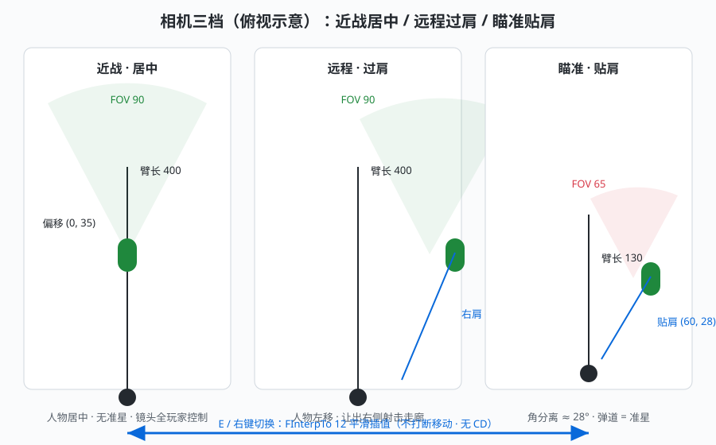
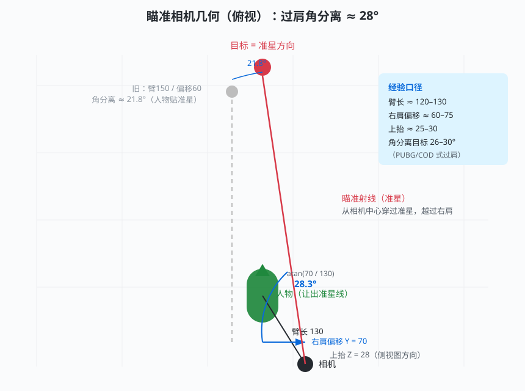
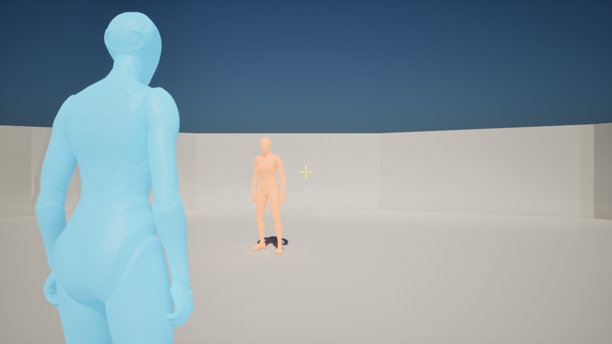
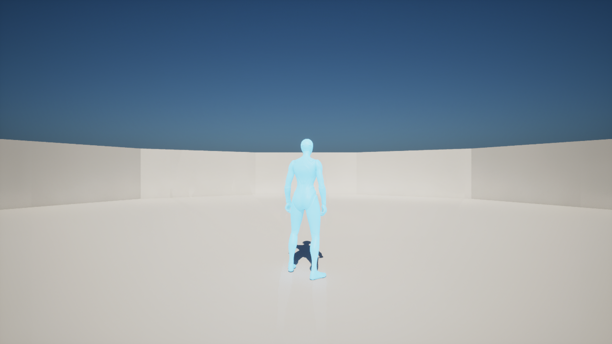
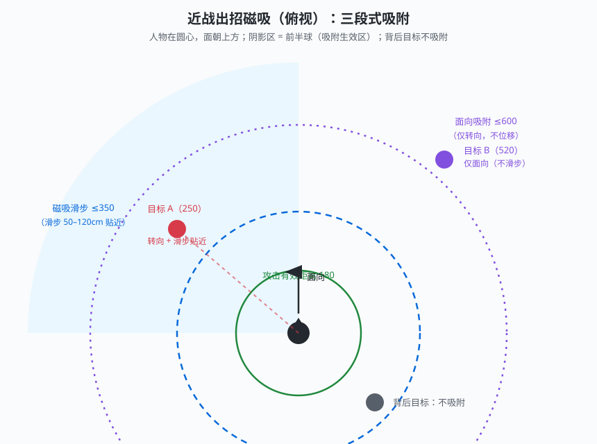

# 战斗相机与索敌设计：三档姿态相机、柔性锁定与出招磁吸

版本：v0.1；更新日期：2026-09-18。状态：相机三档、出招磁吸、开火转身、加速跑闪避**已实现并通过回归**；形态自由切换与瞄准相机参数微调**已定案待实施**。

[文档导航](README.md) · [战斗系统](08_石流龙战斗系统设计.md) · [角色资料](06_石流龙角色方案.md)

**当前方向：近战无准星、人物居中、镜头完全由玩家控制，索敌通过出招磁吸体现（镜头不参与）；远程过肩瞄准，准星方向即弹道方向，开火时角色平滑转向镜头；形态切换即时自由、不打断移动。**

本稿为 08 战斗系统设计的相机/索敌专题配套，定义与参考游戏（PUBG/COD 的过肩瞄准、鸣潮/只狼的锁定、DMC 的即时换装、战神的镜头辅助）对齐的做法与参数。示意图均为原创绘制（参考上述游戏的机制画法，不使用其截图）。

## 1. 设计依据与参考

| 参考点 | 借鉴的机制 | 出处 |
| --- | --- | --- |
| PUBG / COD（TPS） | 瞄准=过肩贴肩相机 + 上半身跟随镜头方向；待机=人物朝移动方向；移动射击有精度代价 | 行业惯例，见 [Mocap Online TPS 动画指南](https://mocaponline.com/blogs/mocap-news/third-person-shooter-animation-guide)、[Epic 分层动画文档](https://dev.epicgames.com/documentation/unreal-engine/using-layered-animations-in-unreal-engine) |
| 鸣潮（索敌反面教材） | 镜头自动回正被玩家诟病——**镜头不应参与索敌**；索敌只应影响角色行为 | [知乎·如何避免做出鸣潮的索敌](https://zhuanlan.zhihu.com/p/706373486)、[NGA 锁定讨论](https://ngabbs.com/read.php?tid=40467234) |
| 战神 2019（GDC） | 为敌人赋权重选镜头聚焦点，镜头自动转向攻击方向；玩家手动转动镜头时辅助让位 | [GDC 译文](https://www.cnblogs.com/gamemanthree/articles/15355111.html) |
| DMC / 猎天使魔女 | 换武器/换形态=同帧状态切换，可取消攻击动画织入连招 | [Stinger Magazine](https://stinger-magazine.com/article/weapon-switching/)、[Game Developer](https://www.gamedeveloper.com/design/weapon-switching---quality-or-quantity-) |
| 只狼 / 黑神话 | 锁定键=硬锁（持续面向+镜头框住）；未锁定=自由镜头 + 攻击方向由输入决定 | [UE5 锁定系统实现](https://www.youtube.com/watch?v=xPxsT6BgNYI) |

## 2. 相机三档（姿态驱动）

| 状态 | 臂长 | SocketOffset (Y, Z) | FOV | 朝向 |
| --- | --- | --- | --- | --- |
| 近战（默认） | 400 | (0, 35) —— **人物居中** | 90 | 朝移动方向（OrientRotationToMovement） |
| 远程（默认） | 400 | (75, 35) —— **右肩**，人物左移 | 90 | 朝移动方向；**开火时转向镜头**（§5） |
| 远程+瞄准（RMB） | 130 | (60, 28) —— **贴肩** | **65** | 面朝镜头（bUseControllerRotationYaw） |
| 索敌键硬锁（近战） | 同近战 | 同近战 | 90 | 持续面向目标 |

- 三档之间全部 `FInterpTo`（速率 12）平滑插值，切形态/开瞄准不打断移动、无可感知顿挫。
- 几何口径：过肩角分离 = atan(偏移Y / 臂长)。瞄准档 atan(70/130) ≈ **28.3°**，人物明显让出准星线（见下图；旧参数 60/150 只有 21.8°，人物贴准星）。

- 准星：**仅远程形态显示**（近战无准星）。远程准星三态：默认松散 → 瞄准收半变青 → 蓄力向心收拢变黄；领域开启变橙加粗。
- 瞄准射线从**相机中心**发出（ResolveAimPoint），弹体从枪口出生但方向对齐准星命中点——“准星即弹道”与“从枪口出现”同时成立。

**本作实机对照（占位模型）**——远程瞄准：人物让出左侧、准星悬空指向目标；近战：人物居中、无准星：

## 3. 索敌：柔性（默认）与硬锁（索敌键）

**设计原则（用户定案）**：镜头不参与索敌——柔性锁定只影响**角色行为**（转向/滑步），硬锁才让角色持续面向目标。近战镜头完全由玩家控制。

### 3.1 出招磁吸（柔性，默认开启）

每次近战出招/连招段激活时，按目标距离三段式处理（目标 = 首选对手）：

| 目标距离 | 行为 |
| --- | --- |
| ≤ 350cm 且在前半球 | **转向目标 + 滑步贴近**：面向目标，滑步 `min(距离−攻击有效距离, 100cm)` 补上空隙（“瞬移到面前”的吸引感） |
| 350–600cm 且在前半球 | **仅转向目标**（不位移） |
| 背后半球 / >600cm | 不吸附，原样出招（保留方向性出招） |

- 只转**角色**，镜头不动——无抽动源。
- 吸附是一次性旋转（出招瞬间），不做每帧跟踪，不与 OrientRotationToMovement 抢朝向。
- `MeleeAutoFace=false` 时整体关闭（M3/M5 方向性近战回归钉住此值）。

### 3.2 索敌键硬锁

- 按下锁定键（默认中键）→ 锁定最优目标：角色持续面向目标（插值速率 10），镜头辅助增强（回正上限 240°/s、死区 2°），移动变为绕行。
- 再按解除。锁定时 OrientRotationToMovement 临时关闭，解除后恢复。

### 3.3 已移除的方案（设计演进记录）

初版实现了“攻击中镜头以限速偏向目标”的回正辅助（鸣潮式），实测反馈**攻击后镜头持续自行旋转、不像正常游戏**。结论与业界一致：镜头回正类辅助极易被感知为失控，本作近战镜头不做任何自动回正（战神的方案在摇杆环境成立，键鼠环境不适用）。

## 4. 形态切换：即时自由、不打断移动

| 项 | 设计 |
| --- | --- |
| 翻转时机 | **按下 E 立即翻转形态**（0 等待），无完成回调延迟 |
| 过程窗口 | 0.1s 表现期（StanceSwitching 标签）：期间攻击请求被拒（防同帧异常），其余行为不受影响 |
| 再按 | 表现期内再按 E = **立即再翻转**（可切回去），无 CD、无间隔限制 |
| 移动 | **全程不打断移动**：StanceSwitching 加入移动例外（DoMove 与移动锁均放行），奔跑速度短暂回落属 0.1s 表现窗口，不可感知 |
| 取消语义 | 切换仍会取消蓄力炮（已扣不退，超级炮按中断进冷却）与输入会话——与既有合法性一致 |

> 对照：旧版 0.25s 定时翻转 + 0.5s 切换间隔 + 移动硬锁，三重叠加造成“有 CD、卡一下、强制停住”三连。业界口径（DMC/Bayonetta 换装 1–2 帧即时切换）与原作石流龙“随意开咒力炮”均支持本设计。

## 5. 远程开火转身（PUBG 式）

- 非瞄准时角色朝移动方向（自由跑动观感）；
- **蓄力/弹体存续期间**：角色以 `FireFaceYawRate = 540°/s` 限速平滑转向镜头 yaw——一帧最多转 ~9°，无跳变；
- 期间 `OrientRotationToMovement` 临时关闭，弹体结束后恢复；
- AI 不适用（AI 朝向由行为树的 SetFocus 负责）。

## 6. 参数总表（FighterDefinition）

| 参数 | 默认 | 说明 | 状态 |
| --- | --- | --- | --- |
| `AimArmLength / AimSocketOffsetY / AimSocketOffsetZ` | 150 / 60 / 25 | 瞄准贴肩（当前实机） | ✅ 已实现 |
| 同上（定案微调） | **130 / 70 / 28** | 角分离 21.8° → **28.3°**，人物让出准星线 | 📐 已定案待实施 |
| `NormalArmLength / NormalSocketOffset(Y,Z)` | 400 / (75, 35) | 远程待机过肩 | ✅ 已实现 |
| `MeleeSocketOffset(Y,Z)` | (0, 35) | 近战居中 | ✅ 已实现 |
| `AimFOV / NormalFOV` | 65 / 90 | 瞄准收窄视场 | ✅ 已实现 |
| `MeleeAutoFace` | true | 近战软锁总开关（M3/M5 钉住 false） | ✅ 已实现 |
| `MeleeAutoFaceRange` | 600 | 面向吸附范围 | ✅ 已实现 |
| `MagnetismRange / AttackReach / MagnetismLunge` | 350 / 180 / 100 | 位移磁吸三参数 | ✅ 已实现 |
| `MeleeFaceInterpSpeed` | 10 | 硬锁面向插值 | ✅ 已实现 |
| `SoftLockYawAssistRate` | ~~90~~ | **已删除**（镜头回正辅助移除） | — |
| `StanceSwitchInterval` | ~~0.5~~ | **已删除**（自由切换无 CD） | 📐 已定案待实施 |
| `StanceSwitchDuration` | 0.1（原 0.25） | 切换表现窗口 | ✅ 已实现 |
| `FireFaceYawRate` | 540 | 开火转身限速 | ✅ 已实现 |

## 7. 验证数据

| 项 | 实测 |
| --- | --- |
| 切形态期间移动保持 | 156cm（持续输入驱动，未被打断） |
| 开火转身误差 | 0.0°（10s 持蓄全程） |
| 磁吸滑步 | 126cm（贴合 120 上限 + 攻击前扑步进） |
| 硬锁面向误差 | 0.0° |
| 回归 | M3 118 / M5 68 / M6 37 / M7-A 25 / M7-B 21 全绿（同一快照） |

## 8. 限制与边界

- 正式石流龙网格/动画未接入（A07）：上半身 Aim Offset、转身动画、切换 Montage 的表现层留正式动画期；当前所有朝向/滑步均为逻辑层，动画接入后无需改动逻辑。
- 真实键鼠手感（准星观感、磁吸强度）留人工演示验证；参数全部 `EditAnywhere` 可调。
- 连按 E 会来回横跳是自由切换的天然结果；若误触困扰，可加“表现期内忽略第二次”的可选项（默认不做）。
