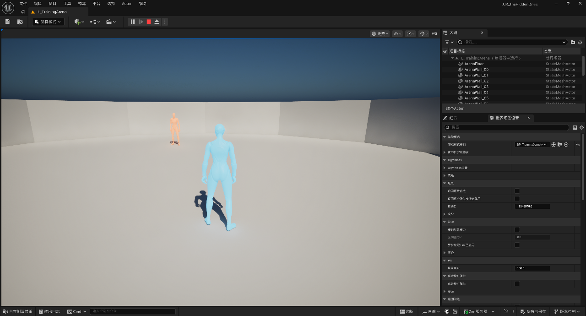

# M1：基础训练擂台

版本：v0.2；建立日期：2026-09-15；实施与自测状态：2026-09-15 自动验收通过，可进入 M2。证据与限制见第 8 节。

[开发过程导航](README.md) · 上一阶段：[M0](M0_工程基线.md) · 下一阶段：[M2](M2_单次攻击闭环.md)

## 1. 目标与进入条件

在同一平坦擂台中稳定生成玩家与一个静止对手，建立共享角色、独立 GAS 状态、自由镜头与目标选择。开始前 M0 应有完整构建和重新打开运行的记录。

本阶段不要求攻击、完整 UMG 或行为树；静止对手仍是完整角色。石流龙身份已确定，正式模型缺失允许占位，但必须提前记录素材风险。

## 2. 预期交付

建议交付 `L_TrainingArena` 白盒关卡、TrainingGameMode、ArenaPlayerController、FighterCharacter 及其薄蓝图、TargetingComponent、ASC/AttributeSet 基座和最小角色定义。名称可适配已有代码，记录实际对应关系。

两个角色共享配置但各自持有 ASC、AttributeSet 和运行状态；GameMode 负责生成与分配身份。不能既由关卡放置玩家又由 GameMode 重复生成默认 Pawn。

## 3. 开发步骤与局部检查

### M1.1 建立平坦白盒与出生点

按 [擂台方案](../07_擂台与视觉参考.md) 以直径 24 m 起步，建立实体边界和两个出生标记。P1/P2 地面 XY 为 `(-500,0)`、`(500,0)` cm，朝向彼此；角色中心 Z 加 Capsule 半高与安全余量。

中央不放大障碍，不实现墙弹或跌落规则。先分清地面、边界和装饰碰撞；记录最终参数而非只保留设计值。

局部检查：占位角色能站稳、走完整圈且不越界；出生点不嵌地、不重叠。

### M1.2 接入双方生成与身份

由一个明确入口创建双方，玩家由 PlayerController 控制，对手保持无主动行为。给 P1/P2 增加可见标记或颜色，保存初始变换供 M2 重置使用。

局部检查：每次进入场景恰好两名战斗角色；玩家输入只影响玩家，双方引用不会指向自己或过期实例。

### M1.3 建立角色 GAS 基座

由 Character 持有 ASC 与 AttributeSet，角色具备必要控制信息后初始化 ActorInfo。初始生命、行动资源、能量和上限来自角色配置；能力列表本阶段可为空。

为初始化和后续授予建立防重复逻辑，重新 Possess 时允许更新控制信息，但不能重复初始化数值或授予相同能力。属性变更调试入口使用集中初始化/重置接口，不作为正常战斗扣血方式。

局部检查：调试输出双方 ASC Owner/Avatar、生命和初始化次数；修改一方调试初值不会改变另一方。

### M1.4 分离镜头、朝向和目标

保留摄像机相对移动；自由水平观察、垂直范围限制、SpringArm 遮挡收缩。TargetingComponent 仅负责目标身份、距离/有效性检查；手动锁定不逐帧强制镜头对准目标。

提供锁定/解除和回正输入语义，记录实际按键。若有辅助回正，手动观察优先；暂不做攻击转向，因为 M2 才接攻击。

局部检查：锁定后能看向侧后方；解除、目标销毁和重新分配均不导致镜头跳变或失效引用。

### M1.5 留训练配置入口并检查石流龙素材

GameMode 留存初始位置、对手模式和配置读取入口，不提前搭全局框架。对手静止只停止主动决策，不关闭角色 Tick、ASC、碰撞或动画。

独立试导入/检查旧石流龙模型的尺度、朝向、Skeleton、基础动画和头部 Socket 可行性，记录可复用项及缺失战斗动画。模型问题与角色基座问题分开处理，未通过就继续用占位模型。

局部检查：生成/目标功能不依赖正式美术；有明确素材检查记录而非“FBX 存在所以可用”。

## 4. 本阶段自测

| ID | 前置与操作 | 预期结果/观察点 |
| --- | --- | --- |
| M1-T01 | 进入白盒，退出再进 3 次 | 每次恰好双方生成，身份、朝向与位置一致 |
| M1-T02 | 前后侧移、沿边行走、靠近对手 | 不嵌地、不越界、不控制对手；边界碰撞连续 |
| M1-T03 | 转动镜头后继续移动 | 移动按当前镜头水平朝向，角色与镜头不争抢旋转 |
| M1-T04 | 锁定对手后持续转镜头，解除并回正 | 观察自由，回正只按设计触发；记录按键 |
| M1-T05 | 靠墙、双方靠近与交叉 | 镜头遮挡收缩正常，无严重穿墙或不可控跳转 |
| M1-T06 | 调试销毁/移出范围的目标，再生成并分配 | 旧引用失效后安全解除；新目标可重新选择 |
| M1-T07 | 查看双方属性、调试修改一方，重复初始化入口 | 状态互不影响；不会重复授予或意外重置另一方 |
| M1-T08 | 检查静止对手的动画/碰撞/ASC | 无主动动作，但各组件仍正常运行 |
| M1-T09 | 使用石流龙试导入记录或占位方案 | 明确骨骼/比例/Socket 结果、缺失项与 M6 处理方式 |

T01—T09 的执行结果见第 8 节。T07 的调试修改仅用于隔离性检查，不替代后续 GE 伤害链路。

## 5. 必须演示的闭环

进入擂台 → 确认两名角色 → 移动和观察 → 锁定后自由转镜头 → 回正 → 目标失效并重新分配 → 退出重进。展示双方独立初始属性和无重复生成。

## 6. 完成标准与交接

- [x] 白盒、两个出生点、身份和独立 GAS 初始化通过自测。
- [x] 自由镜头与目标选择分离，靠墙和目标失效可恢复。
- [x] 记录实际类/资产名、地图入口、碰撞设置和镜头参数。
- [x] 石流龙素材风险有清单，已决定 M2 使用的占位骨骼与攻击动作来源。
- [x] 向 M2 交接角色定义、ASC 获取方式、初始变换和目标有效性入口。

重复角色、共享属性、失效目标崩溃或镜头被强制锁死均阻塞 M2。正式角色外观可在 M6 完善。

## 7. 排查与记录

生成数量异常先查默认 Pawn 与手工 Spawn 是否同时存在；镜头争抢先查 Controller/角色旋转设置及目标 Tick；双方数据串用先查配置资产中是否保存了运行状态。

验收记录：见下节。

## 8. 阶段验收记录：M1 / 2026-09-15

### 实现与环境

- 基于 Git `1d19bbf` 及接手时已有未提交代码/资产继续修复；本轮未创建提交，原有修改保留。
- UE `5.8.2-56702186+++UE5+Release-5.8`，Win64 Development Editor；关闭编辑器后 UBT 构建成功，重开工程加载磁盘资产再执行 PIE。
- [完整修复构建日志](验收记录/M1_Build_Codex_2026-09-15.log)、[重生命名修复构建日志](验收记录/M1_Build_Codex_Respawn_2026-09-15.log)。为常规 UBT 构建，未清空 Intermediate。
- 默认启动与游戏地图均为 `/Game/Maps/L_TrainingArena`；WorldSettings 与项目默认 GameMode 都指向 `BP_TrainingGameMode`。
- 无前台输入依赖：MCP 管理 PIE，Epic 内置 Python Remote Execution 执行脚本；仅使用 loopback。恢复方法见 [自动化问题处理回复](../求救信/M1_UE编辑器自动化通道_处理回复_2026-09-15.md)。

### 实际资产、输入与参数

| 项目 | 实际交付 |
| --- | --- |
| 角色 | `AFighterCharacter` → `/Game/Training/BP_Fighter`；蓝色 P1、橙色 P2 |
| 生成 | `ATrainingGameMode` → `BP_TrainingGameMode`，覆盖 RestartPlayer，DefaultPawnClass 为空，唯一生成入口 `EnsureFightersSpawned()` |
| 输入/镜头 | `AArenaPlayerController` → `BP_ArenaPlayerController`；`IMC_Training` 合并模板移动、Mouse2D、锁定与回正 |
| 按键 | WASD/方向键移动，鼠标观察，中键锁定/解除，C 一次性回正；空格保留模板跳跃 |
| 配置 | `/Game/Training/DA_Fighter_Ishigori`：Health 1000/1000、ActionResource 100/100、Energy 0/100；GrantedAbilities 为空 |
| 全局入口 | `DefaultEngine.ini`：GameDefaultMap/EditorStartupMap 改为 `L_TrainingArena`，GlobalDefaultGameMode 改为 `BP_TrainingGameMode_C`（2026-09-15 起 M1 擂台为日常开发入口；M0 记录的 Lvl_ThirdPerson 仍保留在工程中作模板对照） |
| 占位 | `SKM_Quinn_Simple`、`SK_Mannequin`、`ABP_Unarmed`；网格相对位置 Z=-89 cm，Yaw=-90° |
| 地面 | Cylinder 缩放 `(24,24,1)`，中心 `(0,0,-50)`，顶面 Z=0，外径约 2400 cm |
| 边界 | 12 段切向墙，中心半径 1150 cm，单段约 `646.28×50×250` cm；相邻段有重叠，内侧面半径 1125 cm。可行走内场小于地面外径 |
| 碰撞 | 地面/墙 `BlockAll`；两个 PlayerStart 仅作标记，`NoCollision`；角色胶囊半径 42、半高 96 cm |
| 出生 | 地面 XY `(-500,0)` / `(500,0)`，Yaw 0° / 180°；生成请求中心 Z=100（96+4），角色初始化/落地后中心实测 Z=98.15 cm；记录实际变换供重置 |
| 镜头 | SpringArm 400 cm，遮挡探针沿用模板；俯仰限制 -65°～65°，水平自由；锁定组件不写镜头旋转 |
| 目标 | `UTargetingComponent`，MaxLockRange=2000 cm；仅锁定期间 Tick 检查有效性/距离，解除即停；OnDestroyed 反射回调清理 |

[白盒编辑器总览](验收记录/M1_Codex_Arena.png)

### 执行结果

完整自动验收 **31 项断言通过**，耗时约 16.6 秒；随后退出再进入 **3 次**，每次重新检查双方生成、朝向、属性与初始化次数。

| 用例 | 实际结果 | 状态/证据 |
| --- | --- | --- |
| M1-T01 | 连续三次重新 PIE 均恰好两名角色，位置与身份一致，无默认 Pawn 叠加 | 通过：[M1_Reentry.json](验收记录/M1_Reentry.json) |
| M1-T02 | P1 整圈实际 CharacterMovement 行走；72 个方向的胶囊 sweep 覆盖墙面和接缝，阻挡半径 1081.35～1119.55 cm；角色碰撞有效，P2 未被输入移动 | 通过：[M1_Acceptance.json](验收记录/M1_Acceptance.json) |
| M1-T03 | 镜头转 90° 后注入移动动作，角色沿 +Y 移动；鼠标动作生效；俯仰输入被限至 65° | 通过：同上 T03 |
| M1-T04 | 通过 Enhanced Input 注入实际 Action，验证锁定、鼠标自由观察、解除和回正；锁定时保持 170° 侧后观察不被拉回 | 通过：同上 T04 |
| M1-T05 | 贴西墙时 SpringArm 收缩，镜头 X=-1113 cm 位于墙内侧；离墙恢复全长；胶囊接近/环绕路径无穿越 | 通过：同上 T05；长时间主观手感仍由人工体验补充 |
| M1-T06 | P2 移至 5000 cm 后解除；回场可再锁；Destroy 后回调清理；重生后重新分配；额外连续三次销毁/重生保持恰好两名角色 | 通过：同上 T06，最后角色名 `Fighter_P2_3` |
| M1-T07 | 双方不同 ASC/AttributeSet，共享只读定义；P1 临时定义经集中 Reset 得到 500 HP，P2 与原 DA 保持 1000；重复初始化/重新 Possess 计数仍各为 1 | 通过：同上 T07；本阶段能力表为空，非空授予的运行测试留 M2 |
| M1-T08 | P2 无控制器，但 Actor/Mesh Tick、AnimInstance、胶囊碰撞与 GAS 属性正常，CharacterMovement 正常落地 | 通过：同上 T08 |
| M1-T09 | 旧 FBX 独立试导入，记录尺寸/骨架/方向/头部插槽与动作；明确采用模板占位继续 M2 | 通过：[素材检查](验收记录/M1_石流龙素材检查.md)、[原始数据](验收记录/M1_ArtReview.json) |

### 修复与复测

1. 原地面缩放 12 导致直径约 12 m；围墙沿径向放置且半径仅 640 cm。改为 24 m 地面和连续切向围墙，整圈行走与接缝 sweep 通过。
2. PlayerStart 与角色胶囊冲突导致出生偏到 Y=-67；关闭标记碰撞后连续重进均 Y=0。
3. GameMode 未使用配置输入 Action 的 Controller 蓝图；IMC 脚本写了 5.8 的弃用 `mappings` 字段。改为正确 Controller 与 `default_key_mappings.mappings`，补齐 Mouse2D，实际 Action 分发通过。
4. Fighter 配置原本可能晚于 BeginPlay；改为延迟构造，先赋身份/定义再 FinishSpawning。无控制器对手启用物理；本地 PawnClientRestart 负责补装输入上下文。
5. 目标销毁回调补 `UFUNCTION`；锁定期间检查距离，失效解除并停 Tick，广播失效与主动解除区分。
6. 新增重生通路时复现致命错误：已销毁但尚未回收的 `Fighter_P2` 与固定新名字冲突。设置 `NameMode=Requested`，允许唯一后缀；连续重生回归通过。对象名不承担角色身份。
7. 修正属性集 GE 后置钳制使用 `GetHealth()`，避免误将伤害 Magnitude 当成剩余生命；M2 仍需验证完整 GE 伤害链路。
8. 复制角色网格的模板相对变换，修复脚底偏移；身份材质启用 SkeletalMesh usage，双方颜色在实际 PIE 截图可见。

### M2 交接

- 定义：`UFighterDefinition` / `DA_Fighter_Ishigori`。只读配置可共用，ASC、AttributeSet、目标、动态材质、初始变换按实例保存。
- 获取 ASC：`IAbilitySystemInterface::GetAbilitySystemComponent()` 或 `GetFighterAbilitySystemComponent()`；ActorInfo Owner/Avatar 都是本角色；控制器变化允许更新 ActorInfo。
- 目标：`GetTargeting()->GetCurrentTarget()` / `IsTargetValid()`；包含距离/销毁/非自身检查。`GetOpponentOf()` 用于身份关系，攻击前仍须验证目标。
- 重置：`GetInitialTransform()` / `ResetToInitialState()`；集中属性写入只用于初始化和训练重置，正常伤害/资源消耗接 GE。
- 调试控制台：`JJKFighters`、`JJKReinitFighters`、`JJKResetFighters`、`JJKKillTarget`、`JJKRespawnFighters`。
- M2 普攻占位：`/Game/Characters/Mannequins/Anims/Unarmed/Attack/MM_Attack_01`（1 秒），与 Quinn 同用 `SK_Mannequin`。之后可评估 MM_Attack_02/03；不整体搬入 Variant_Combat 的技能规则。
- 复测命令：`python Scripts/run_m1_acceptance.py`。运行前打开本工程编辑器；脚本管理 PIE 并把证据写到本节链接文件。

进入 M2：**是**。当前闭环经实际 PIE 与自动输入验证。未进行实体键鼠人工操作、长时间镜头手感评估、跨帧率专项及独立打包；这些不应冒充本次测试结果。正式石流龙外观与战斗动画适配留 M6。
