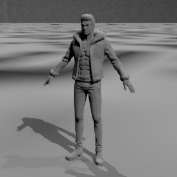

# M1 石流龙素材检查 / 2026-09-15

结论：旧模型可在 UE 5.8.2 导入并绑定现有移动动画；仍不适合直接作为 M2 战斗基座。M2 使用 Quinn + SK_Mannequin + MM_Attack_01。

## 实测

- 只读源目录 `F:/GameStudy/JJKDemo/sll`；未打开、升级或修改旧工程。四份源 FBX 的大小与 SHA-256 见 [M1_ArtReview.json](M1_ArtReview.json)。
- 独立导入 `/Game/Training/ArtReview`，无当前角色/地图对该目录的引用。
- 模型高约 **190.479 cm**；根骨 `Hips`，共 **65 根骨骼**，单个材质槽；导入日志显示 **999,774 三角面**。生成高模资产约 124 MB。
- 参考姿势左脚至脚趾向量约 `(5.987,13.351,-10.424)` cm，水平前向主要为 **+Y**；正式 Character 以 +X 为前，M6 接入时应以 Yaw=-90° 为校准起点，再核对头部炮口轴与实际动画。
- `Head` / `HeadTop_End` 存在。成功添加并保存 `Muzzle_Head_Review`，父骨 `Head`；本次验证可挂接性，炮口局部偏移/旋转未定稿。
- 待机 **6.0 s**、走路 **1.0333 s**、跑步 **0.6333 s** 均导入成功，使用同一个新导入 Skeleton；尚未验收重定向后的战斗表现。

## 可复用与缺口

| 项目 | M2/M6 决策 |
| --- | --- |
| 角色轮廓/骨架 | 保留，M6 做面数压缩/LOD、材质、物理资产和胶囊适配 |
| 基础移动动作 | 可作为 M6 原始动作输入；先验证根运动/脚滑/朝向 |
| 头部 Socket | 可创建；M6 校准炮口位置、局部轴、贴墙行为 |
| 战斗动作 | 当前四份源 FBX 无普攻、防御、闪避、投技、受击、倒地、起身、死亡及炮击；需补充或重定向 |
| 当前占位 | `SKM_Quinn_Simple`，Skeleton=`SK_Mannequin`，AnimBP=`ABP_Unarmed` |
| M2 单次攻击 | `MM_Attack_01`，时长 1.0 s，实读 Skeleton 与 Quinn 完全相同；M2 再制作独立 Montage/命中窗口 |

`Content/Training/ArtReview/` 为可重建的试导入目录，已单独加入 Git 忽略，避免把约 124 MB 的评估高模当作正式角色交付。源 FBX 仍保留在旧工程，报告/哈希/导入脚本纳入当前项目；旧工程的素材备份仍需保留。运行 `python Scripts/ue_python.py Scripts/M1_art_review.py` 可重建试导入与检查记录。
