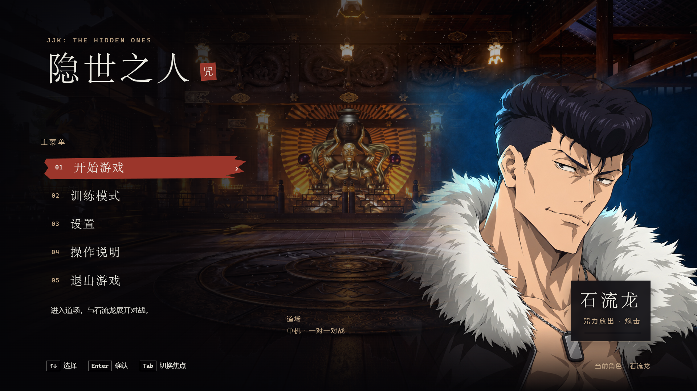

# JJK: The Hidden Ones · 隐世之人

> Unreal Engine 5.8.2 · C++ · Gameplay Ability System · 单机第三人称 1v1 · 石流龙

基于《咒术回战》角色创作的动作战斗 Demo，用于个人学习与求职作品集。项目围绕石流龙的近远程形态、拳腿连招、咒力炮与原创领域实现战斗，并接入训练 / AI 对战、战斗反馈和完整菜单入口。

**当前阶段：Alpha 试玩候选。** 石流龙角色资源、日式道场、近战动作、炮击表现、战斗 HUD 与新版菜单已有接入；当前本地分发号为 `v0.1.0-alpha.1`。玩家反馈的“启动后卡在地面”、暂停背景读取及性能问题仍待关闭。GitHub 尚未发布可下载 Release，当前不能作为稳定交付版本。

本项目与《咒术回战》官方无关。“极宴流光”及其完整领域机制为项目原创设计。



*实际 UE 菜单截图；截图展示界面接入，不代替当前独立包的完整战斗验收。*

## 当前实现

| 模块 | 已有内容 |
| --- | --- |
| 角色与场地 | 石流龙角色网格与动画接入；日式道场为正式玩法地图，保留白盒地图用于回归；道场原素材通过独立玩法层适配 |
| 近战 | 四段拳、三段腿、蓄力重拳 / 重踢、正面格挡、移动冲刺 / 原地后撤、规则允许的取消与出招贴近 |
| 远程 | 可移动蓄力炮、定点超级蓄力炮、按住右键瞄准；伤害与咒力成本随蓄力增长并封顶，可继续保持蓄力 |
| 原创领域 | 自动输出最大威力曲线追踪炮；领域资源、双领域压制、结束清理与术式熔断；倒地 / 死亡 / 重置保护保留 |
| 对战与训练 | 木桩 / 固定防御 / AI；共享动作请求和结算链路；资源辅助、统计、胜负与重开 |
| 战斗反馈 | 真实命中 / 格挡 / 免疫 / 撞墙事件驱动声音、受击、镜头和 HUD；局部顿帧及炮击收尾；近战命中粒子保持关闭 |
| 菜单与 HUD | 主菜单、模式选择、暂停、操作说明、画面 / 音频 / 操作 / 训练设置；四资源、蓄力、冷却、领域与熔断提示 |

部分通用 / 派生动作、方向受击和专用领域演出仍在打磨；已接入角色不代表所有美术表现已经完成。道场关闭投技，白盒保留原规则验证入口。

## 试玩与版本

[GitHub Releases](https://github.com/YaronH1125/JJK_theHiddenOnes/releases) · [当前候选发行说明](Docs/releases/v0.1.0-alpha.1.md) · [更新记录](CHANGELOG.md)

截至 2026-10-03，运行 ZIP 仅本地归档，尚无 GitHub 下载附件或确认的外部下载地址。GitHub 自动生成的 **Source code (zip / tar.gz)** 不是游戏运行包。

拿到实际 Windows 试玩包后：

1. 完整解压到 `D:\Games`、`C:\Games` 等较短目录，保留 `Engine/` 和 `JJK_theHiddenOnes/`。
2. 双击顶层 `JJK_theHiddenOnes.exe` 进入主菜单；开始游戏进入 AI 对战，训练模式进入练习。
3. 当前 `Play.cmd` 是开启顿帧并设置 60 FPS 上限的对照入口；直接开 exe 时，原包顿帧默认关闭。统一正式默认体验仍待验证。
4. 如缺少 VCRUNTIME / MSVCP，安装包内 `Prerequisites/vc_redist.x64.exe` 后再启动。

试玩不需要 UE 编辑器、源码或原素材归档。当前菜单运行依赖在过长路径下实测加载失败；短路径是该候选的兼容性要求。完整分发、校验与版本规则见 [发布指引](Docs/22_试玩版发布与版本管理.md)。

## 操作

| 输入 | 近战形态 | 远程形态 |
| --- | --- | --- |
| WASD / 鼠标移动 | 移动 / 转动视角 | 同左 |
| Shift | 移动冲刺 / 原地后撤，取消资格按当前动作规则判定 | 同左 |
| 鼠标左键 | 点按四段拳；长按蓄力，松开重拳 | 按住移动蓄力，松开发射普通炮 |
| Q | 点按三段腿；长按蓄力，松开重踢 | 按住定点蓄力，松开发射超级炮 |
| E | 切换近战 / 远程 | 同左 |
| F | 防御 | 防御 |
| R | 满足资源条件时展开领域 | 同左 |
| 鼠标右键 | — | 按住瞄准，松开恢复 |
| 鼠标中键 | 切换目标锁定，持续面向 | 同左 |
| Esc | 暂停 / 返回，按菜单状态处理 | 同左 |
| F1 | 新版训练设置 | 同左 |
| 空格 | 对局结束后重新开始 | 同左 |

正常资源 AI 试玩应关闭自动回血、无限生命、无限资源和无冷却辅助。取消、格挡、领域保护与资源不足的具体行为见 [战斗设计](Docs/08_石流龙战斗系统设计.md) 和 [近战动作](Docs/19_石流龙动作设计.md)。

## 技术实现与验证范围

核心实现位于 [Training](Source/JJK_theHiddenOnes/Training)：

- `CombatInputComponent` 与 GAS 能力负责共享请求、资源、合法性和动作生命周期；AI 复用玩家规则。
- `CombatHitComponent`、`BlastProjectile`、`DomainOrb` 负责近战 / 炮击 / 领域的真实接触与统一结算。
- `CombatFeedbackComponent` 和 `Feedback/` 消费真实结果，接入局部停顿、受击、音频、特效与镜头；表现不二次结算伤害。
- `ArenaPlayerController`、`ArenaMenuWidget` 与 `ArenaCombatHudWidget` 管理菜单暂停 / 输入恢复、设置与正式 HUD。本地 HTML 复用菜单设计，战斗仍由 C++ / GAS 驱动，运行不依赖网页服务。

仓库提供规则、输入 / 取消、重置、反馈、菜单和打包的可复用检查脚本，见 [Scripts](Scripts/README.md)。历史 PIE、规则烟测、主菜单启动与完整真人实战的覆盖范围不同，不能累加不同版本的通过计数宣称当前包全部通过。

当前分发 ZIP 的 CRC、124 个文件校验与本机主菜单启动检查通过；这些检查未覆盖点击开始后的完整正常资源对局。现有玩家反馈与历史运行异常仍按已知问题保留，原始证据本地归档。

## 源码构建

1. 安装 UE 5.8.2 和对应 C++ 编译工具链，使用 Python 运行项目脚本。
2. 按 [素材恢复说明](Docs/12_版本控制与素材依赖.md) 恢复道场、炮击 / 光束等外部原素材；`Content/FightingAnimsetPro/` 另作为动画来源库本地维护。仅 clone 仓库无法获得完整原素材。
3. 执行 `python Scripts/check_external_assets.py` 核对清单覆盖的三套原素材；该检查不覆盖整个工程依赖，出现差异应核对来源。
4. 构建 `Development Editor` 并打开 `JJK_theHiddenOnes.uproject`。编辑器默认打开白盒 `L_TrainingArena`；道场 `L_DojoArena` 为打包默认地图，开发时可手动打开。

包含新版菜单的独立包：关闭本项目编辑器后，在项目根目录运行：

```powershell
powershell -ExecutionPolicy Bypass -File Scripts/build_menu_demo.ps1
```

输出到独立的 `Saved/Packages/MenuUI_<日期时间>/Windows/`。脚本引擎路径当前为 `F:/GameStudy/UE_5.8`，其他机器需调整。首次构建执行完整 Cook；复用 Cook 前必须确认资源与当前源码 / 资产对应。

`Scripts/build_dojo.ps1` 是道场构建 / 回归入口，不等于已经整理好的最新发行 ZIP。打包成功后还需执行完整试玩流程；菜单启动 smoke 不能代替开始游戏后的输入与对战检查。

## 已知问题与下一步

| 优先级 | 当前事项 |
| --- | --- |
| P0 | 定位玩家反馈的启动后卡在地面，验证首次进入、菜单恢复、出生与移动的完整流程 |
| P0 | 处理暂停背景读取的 DirectX 12 非致命 ensure，以及首次载入 / 炮击卡顿 |
| P0 | 形成对应源码提交的新候选，复验菜单到整局、退出重启和目标配置性能 |
| P1 | 统一 exe 默认试玩体验；完成另一环境验证、操作录像和公开预发布附件 |
| P2 | 方向受击、专用蓄力 / 领域演出、步态与背景音乐等表现精修 |

目标画质下稳定 60 FPS、高帧率时钟专项和完整 M7 交付尚未闭环。当前单角色、单人训练 / AI 范围不包含联网对战或剧情。

反馈请使用 [Issues 试玩问题模板](https://github.com/YaronH1125/JJK_theHiddenOnes/issues/new/choose)，注明版本、操作步骤、实际表现和硬件 / 画质，附关键截图或日志片段。

## 文档入口

- [项目文档导航](Docs/README.md)
- [战斗系统](Docs/08_石流龙战斗系统设计.md) · [相机与索敌](Docs/09_战斗相机与索敌设计.md) · [动作接入](Docs/19_石流龙动作设计.md)
- [HUD 设计](Docs/13_对战HUD设计稿.md) · [HUD 开发指引](Docs/14_HUD开发指引.md)（当前原型 V9）· [菜单设计与接入](Docs/21_菜单UI设计稿.md)
- [源码素材依赖](Docs/12_版本控制与素材依赖.md) · [试玩发布与版本管理](Docs/22_试玩版发布与版本管理.md)

开发过程、Agent 分工与原始验收记录保留在本地，不参与版本管理。README、长期设计 / 使用说明、更新记录及对外发行说明随仓库维护；程序包与第三方原素材独立归档。
